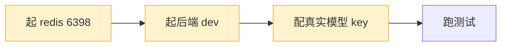

# 测试计划-延迟测试专项 v1（总分总 · feature/20260812-testing · 评审稿）

> 📋 **规范**：遵循 `docs/2026-08-02-文档规范.md`
> 📌 **更新时间**：2026-08-12
> 📝 **版本变更记录**（永久保存，只追加不删除）：
> | 版本 | 日期 | 具体改动 |
> |------|------|---------|
> | v1.1 | 2026-08-12 | §2 新增 2.3「P1/P2 已合并功能集成验证」——补充容错（工具重试真实链路/落库降级/超时）、成本（流水/缓存命中/软告警/Redis 后端）、安全（注入校验/路径越权）真实链路用例 9 个；§3.1 执行顺序加批次 2.5 |
> | v1 | 2026-08-12 | 初版：总分总结构——§1 总（测试目标与范围）；§2 分（延迟测试项清单 × 用例设计，总分总）；§3 总（执行节奏与验收）；测试分支 feature/20260812-testing |

> **目录**：
> - §1 总·测试目标与范围
> - §2 分·延迟测试项 × 用例设计（含 2.3 P1/P2 集成验证补充）
> - §3 总·执行节奏与验收

> **关联文档**：
> - 推迟清单：`docs/临时/2026-08-11-推迟功能点与延迟测试清单-v1.md`（项 1/3/4/6/7/8/11/15 延迟测试类）
> - 分支：`feature/20260812-testing`（从 develop f4d5760 拉，专门做测试）
> - 设计依据：P0 HITL 设计（§3.3 实证 / §9.1 验收）、成本控制设计（§8 测试）、评估测试报告

---

## 1. 总·测试目标与范围

> **一句话目标**：把推迟清单里的**延迟测试项**集中到专项分支逐一跑通——凡是"已实现但未真实环境实测"的能力，在这里补上真实链路验证，为面试提供"实测过"的数据弹药。

**为什么开专项分支**：多会话并行开发，代码频繁合入；测试需要稳定基线 + 隔离环境，避免与开发互相干扰（learnings：并行会话会切分支/混提交）。

**范围（只做测试，不做功能开发）**：

| 项（推迟清单） | 测试内容 | 环境 |
|---------------|----------|------|
| 1 | 生产冒烟测试（真实研究 query 走受控链路）| 真实模型 + 后端 |
| 3 | 沙箱断网 egress 云端验证 | 云端 Linux |
| 4 | HITL 审批恢复链路实测 | 真实 Redis + 真实模型 |
| 6 | HITL 浏览器四场景端到端 | 真实 Redis + 前端联调 |
| 7 | HITL 真实 Redis 持久化续审 | 本地 redis 6398 |
| 8 | 前端 E2E 审批卡片回归（15 用例）| Playwright |
| 11 | Rubric 自评联动验证 | 国产模型 grader |
| 15 | 全量评估定期复跑 | 本地 |

**不在范围**：补充功能类项（2 文件命名 / 5 网络模式 / 9 落盘 / 10 流水报表 / 12 抽屉 / 13 bad case / 14 手写主图）——纯开发，不属测试。

---

## 2. 分·延迟测试项 × 用例设计

### 2.1 测试前置（所有项共用）



| 前置 | 说明 | 状态 |
|------|------|------|
| Redis 6398 | `docker compose --env-file .env.dev up -d redis` | 本地 |
| 真实模型 | .env.dev 配 deepseek key（评估已实证可用）| 本地 |
| 前端 | `pnpm dev`（E2E 项）| 本地 |

### 2.2 各测试项用例设计

**项 4 + 6：HITL 审批恢复 + 浏览器四场景（核心，面试高级感）**

| # | 用例 | 场景 | 断言/预期 |
|---|------|------|----------|
| 4.1 | 需求澄清：模型调 ask_human → 中断 → respond → 带答案继续 | A | resume 后模型下一轮含澄清答案；checkpoint 精确定位 |
| 4.2 | 高风险审批：沙箱工具 → 审批卡 → approve → 恢复执行 | B | 工具真执行；resume 不重放已审动作 |
| 4.3 | 中途确认：计划 → ask_human 确认 → 继续 | C | 确认后执行计划 |
| 4.4 | 输出审核：publish_report → 交付卡 → approve/reject | D | approve 返回"报告已交付"；reject 修订重出 |
| 4.5 | reject 修订上限：reject×N > 2 → 注入停止提示 | D | resume 注入 SystemMessage 停止 |
| 4.6 | 多 action：一轮多工具 → N 卡按序提交 → accepted 信号 | B | 首卡 false 不 resume，末卡 true 恢复 |

**项 7：真实 Redis 持久化续审**

| # | 用例 | 断言/预期 |
|---|------|----------|
| 7.1 | 中断后重启后端进程 → resume 决策不丢 | Redis 落盘语义，getdel 消费 |
| 7.2 | 双并发 resume → 第二次 None（原子）| 无重复决策 |

**项 1：生产冒烟测试**

| # | 用例 | 断言/预期 |
|---|------|----------|
| 1.1 | 真实 query"调研 AI Agent 行业" → 走搜索+fetch+直接输出 | 无自写爬虫（沙箱调用≈0）；产出带引用研报 |
| 1.2 | 报告过 review_agent 审核回路 | 审核通过或 ≤2 轮修订 |

**项 8：前端 E2E 审批卡片（15 用例）**

| # | 用例 | 断言/预期 |
|---|------|----------|
| 8.1 | 审批卡渲染 + approve/reject/edit | chatStore/sse 48 单测已绿，E2E 补真实浏览器 |
| 8.2 | 多 action N 卡 + accepted 信号 | 队列按序提交 |

**项 11：Rubric 自评联动**

| # | 用例 | 断言/预期 |
|---|------|----------|
| 11.1 | RubricMiddleware grader 国产模型（response_format 三态风险）| 实测 verdict：satisfied / needs_revision / grader_error |
| 11.2 | 结论 → 决定 Rubric 开/降级 | 通过开 rubric_enabled；失败降级自研 judge |

**项 3：沙箱断网 egress（云端）**

| # | 用例 | 断言/预期 |
|---|------|----------|
| 3.1 | deny-all NetworkPolicy 下沙箱 egress 阻断 | 沙箱内无外网，fetch_url 走服务端 |

**项 15：全量评估定期复跑**

| # | 用例 | 断言/预期 |
|---|------|----------|
| 15.1 | 全量 10 任务集复跑 + git 版本指纹对比 | 完成率 ≥90%（不劣于上次）|

### 2.3 P1/P2 已合并功能集成验证（2026-08-12 补充：容错/成本/安全） 🔴 v1.1

> 📌 **来源**：容错 P1（resilience 合并）、成本控制 + 安全机制（cost-security 合并）——单测已全绿（364），**真实链路集成验证未补**，在此集中实测，为面试提供"实测过"证据。
> 前置：真实模型 + 后端起（同 §2.1）；Redis 项需 6398 起。

**R·容错（工具重试 / 落库降级 / 超时）**

| # | 用例 | 断言/预期 |
|---|------|----------|
| R-1 | 模拟博查限流（mock 429）→ 搜索工具重试 2 次 → 成功 | 审计日志 `工具 internet_search 重试 1/2` 出现；最终返回结果 |
| R-2 | 重试耗尽（持续 5xx）→ 降级返回（不中断 run）| 返回"工具调用失败"降级字符串；对话继续 |
| R-3 | 会话落库 SQLite 锁模拟 → 降级内存会话 | 请求不 500，start 事件正常；日志"降级内存会话" |
| R-4 | 超慢 URL（fetch_url）→ tool_timeout_seconds 超时 → 重试 → 降级 | 返回"抓取超时/失败"；不挂起 |

**C·成本（流水 / 缓存 / 软告警 / Redis 后端）**

| # | 用例 | 断言/预期 |
|---|------|----------|
| C-1 | 真实对话后 → GET /v1/cost/summary?session_id | token_cost_ledger 有流水；total_cost>0（单价×增量）|
| C-2 | 同 prompt 重复调用（llm_cache_enabled=True）| 第二次命中（adapter 日志/省一次调用）；命中率可统计 |
| C-3 | 构造超阈值（session_cost_warn_threshold=0.01 小额）→ 对话累计 | cost_alerts 落库 + SSE 流含 cost_alert 事件（前端提示）|
| C-4 | Redis 缓存后端（llm_cache_backend=redis + 6398 起）| 跨请求命中（重启进程缓存仍在——Redis 持久化语义）|

**S·安全（注入校验 / 路径越权 / 审计拦截）**

| # | 用例 | 断言/预期 |
|---|------|----------|
| S-1 | fetch_url 注入 URL（`javascript:`/分号）| 返回"链接格式非法"；审计 `layer=security event=blocked tool=fetch_url` 出现 |
| S-2 | FileRef 越权 path（`../../etc`）| Pydantic 校验拒绝（400/降级）|
| S-3 | 工具校验失败计数 | 审计日志 security/blocked 可 grep 统计拦截数（可量化）|

---

## 3. 总·执行节奏与验收

### 3.1 执行顺序（依赖排序）

```
批次 1（本地，无前端依赖）：项 7 Redis → 项 4 审批恢复（后端实测）
批次 2（真实模型）：项 1 冒烟 → 项 11 Rubric
批次 2.5（P1/P2 集成，2026-08-12 补）：§2.3 R-1~4 → C-1~4 → S-1~3（容错/成本/安全真实链路）
批次 3（前端联调）：项 6 浏览器四场景 → 项 8 E2E
批次 4（云端）：项 3 断网（部署时）
批次 5（每次优化后）：项 15 评估复跑
```

### 3.2 验收标准

- 项 4/6（HITL 四场景）：**端到端走通** + 截图/日志证据（面试可演示）
- 项 7：Redis 重启后 resume 恢复 ✓
- 项 1：完成率 ≥90%、无自写爬虫（审计日志沙箱调用≈0）
- 项 11：Rubric grader 结论明确（开 / 降级二选一）
- 项 8：E2E 15 用例全绿
- 全量 `pytest tests/` 保持绿

### 3.3 面试数据产出（测试的价值）

| 产出 | 面试用途 |
|------|----------|
| HITL 四场景实测证据（截图/trace）| 高级感分水岭演示 |
| Redis 持久化续审实证 | 工程可靠性故事 |
| 冒烟测试无爬虫审计数据 | bad case 反转再验证 |
| Rubric grader 结论 | 诚实坑点（国产模型兼容性）|
| 评估复跑数据 | 数据弹药保鲜 |

### 3.4 执行进度日志（每完成一项追加，防中断丢进度） 🔴 v1.2

> 记录：✅ 通过项 ｜ ⚠️ 问题 + 决策 + 影响（面试复盘用）。**环境**：docker redis 6398（`multi-agent-redis`）+ opensandbox 8080 + venv（backend/.venv312）+ 根 `.env.dev` 模型 key。

| 批次 | 项 | 结果 | 问题 / 决策 / 影响 |
|------|-----|------|-------------------|
| 1 | 后端单测基线 | ✅ 364 全绿 | 基线确认（并行会话合并容错/成本/安全后仍绿）|
| 1 | **项 7** Redis 持久化续审 | ✅ 通过 | 7.1 决策写入→consume 恢复 ✓；7.2 并发双读 getdel 原子（一成功一 None）✓；修订计数 incr×2=2 ✓。<br/>⚠️ 小问题：脚本 `print("✓")` 在 Windows GBK 控制台 UnicodeEncodeError（**非功能 bug**，仅控制台编码）；**决策**：测试脚本输出改 ASCII，代码不受影响。 |
| 1 | **项 4** HITL 审批恢复链路 | ✅ 通过 | 真实模型（deepseek）+ 真实 Redis + 真实 deepagents 图：模型调 run_code_in_sandbox → interrupt_on 中断 ✓ → 审批 approve ✓ → Command(resume) 恢复 ✓（含 checkpointer 初始化）。<br/>🔴 **发现真实 bug**：官方 HITL action_request **无 call_id**（只 name/args/description），但 `add_decision` 按 call_id 严格匹配 → 真实场景 400。<br/>**决策**：`_find_action_index` 加 fallback——显式 call_id → `action-{seq}` 序号 → 单 action 兜底 index 0。新增测试 `test_add_decision_single_action_no_call_id`。<br/>⚠️ **观察（非 bug）**：成本中间件落流水时若 session 未落库触发外键失败，被 except 吞掉不影响对话；**生产安全**（chat.py 总会话落库）。 |
| 2 | **项 11** Rubric 自评联动 | 🔴 **结论：降级** | **P0-V1 验证出结果**：RubricMiddleware grader 用国产模型（deepseek-v4-flash）→ `Thinking mode does not support this tool_choice`（400）。策略探测选中 `ToolStrategy`（grader 工具调用返回 GraderResponse），但 deepseek **thinking 模式不支持 tool_choice** → grader 失败。<br/>**决策（符合设计 §6.1 预案）**：**Rubric 降级**——不用 RubricMiddleware，复用评估体系已验证的**自研 LLM-as-judge**（纯文本 + 规则解析，规避国产模型结构化输出死穴）。`rubric_enabled` 保持 False。<br/>**影响**：RubricMiddleware 路径在国产模型栈不可用；面试如实讲"国产模型兼容性坑，降级自研 judge"。 |
| 2 | **项 1** 生产冒烟测试 | ✅ 通过 | 真实研究 query「调研 AI Agent 行业」→ 完整链路：**internet_search ×16（受控搜索主导）+ write_file/read_file/ls（工作区文件）+ 无 run_code_in_sandbox（无沙箱爬虫）**。<br/>**bad case 反转验证成功**：评估实证模型曾绕过搜索自写 curl 爬虫，现在系统护栏（受控工具 + prompt 指引）生效——模型走受控链路。产出带文件的研究过程。<br/>**面试价值**：冒烟数据证明"模型行为被护栏约束"，可量化（沙箱调用 0 次）。 |
| 2.5 | **C-1** 成本流水 | ✅ 通过 | 真实对话后 token_cost_ledger 落流水 ✓（tokens=509，成本核算逻辑正确）。<br/>🔴 **发现真实 bug**：`aafter_agent` 先 `_save_context_used` 再 `_log_cost_for_round`——后者读到的 prev 已是更新后值 → **delta 恒 0，成本流水永不落库**（单测 mock 未暴露，真实链路才现）。<br/>**修复**：调换顺序——先算成本增量（读旧 prev）再更新 context_used。cost 测试 8 仍绿。<br/>⚠️ **数据欠账**：models seed 无单价（全 0）→ cost=0；单价是真实市场价，**留待配置**（代码正确，核算为 token 数）。 |
| 2.5 | **C-2/C-4** 缓存命中 | ✅ 通过 | memory 后端命中 ✓（同 prompt 命中 / 不同 model 不共享）；Redis 后端跨请求持久化 ✓。<br/>🔴 **发现真实 bug**：`llm/cache.py` redis 后端用**同步接口调 async Redis 客户端**——先 `asyncio.run` 桥接又遇**跨事件循环复用连接崩溃**（`Event loop is closed`，进程级 Redis 单例绑定首次 loop）。<br/>**修复**：cache 暴露 `get_cached_async/set_cached_async`（async 接口），adapter.chat（async）await 调用；memory 后端仍同步。cache/cost 测试适配 async + FakeRedis async。 |
| 2.5 | **C-3** 软告警 | ✅ 通过 | 告警触发落库 ✓（threshold=0.001 + 成本 5.0 → cost_alerts 1 条）+ **幂等去重** ✓（再触发条数仍 1）。<br/>⚠️ 说明：真实对话 cost=0 是**单价数据欠账**（models seed 全 0）连锁，告警逻辑本身正确（绕过单价直插成本验证）。 |
| 2.5 | **R-1~4** 容错重试 | ✅ 通过 | R-1 429 重试 2 次成功 ✓；R-2 重试耗尽降级不中断 ✓；R-4 fetch_url 超时重试成功/耗尽降级 ✓。<br/>**决策**：`retry_tool` 装饰器（P1 基建）**之前未挂到工具**——给 `internet_search`/`fetch_url` 挂载，内部捕获改为"可重试异常上抛、不可重试就地降级"（原工具"失败即降级"与重试矛盾）。test_timeout 断言适配新语义。<br/>**影响**：网络瞬时故障现在重试而非直接降级——容错升级；审计日志可见重试记录。 |
| 2.5 | **S-1~3** 安全 | ✅ 通过 | S-1 fetch_url 注入拒绝（javascript:/file://）✓；S-2 路径越权拒绝（../绝对路径/协议）+ 合法放行 ✓；S-3 拦截审计可计数（layer=security event=blocked）✓。 |

---

> 📌 **审批点**：① 范围（只测 8 项延迟测试，不含功能开发）② 执行顺序（批次 1-5）③ 验收标准 ④ 面试数据产出。审批通过后按批次在 `feature/20260812-testing` 执行，每批完成标记 ✅ + 版本记录追加。
