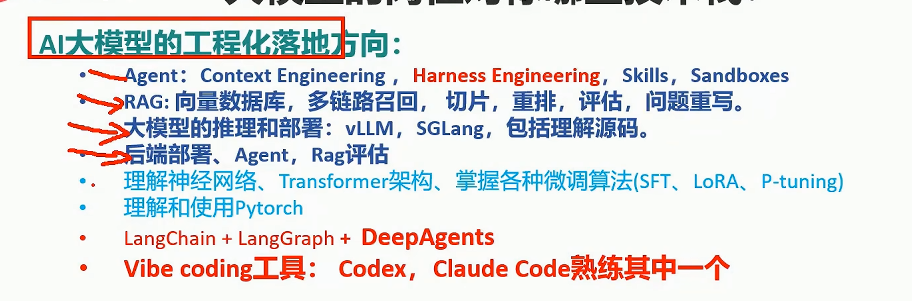

# harness 学习

> 📋 **规范**：遵循 `docs/文档规范.md`
> 📌 **更新时间**：2026-08-02
> 🔄 **最近三次改动**：
> 
> | 版本 | 日期 | 改动 |
> |------|------|------|
> | v1 | 2026-08-02 | 并入 docs/ + 加规范头（原始口述笔记，正文未动） |
> 
> **目录**：
> - 原始口述笔记（无章节）

---

**应该在我的项目中的智能体去问。**

需要分类， 目录 区分p0 p1 px 。 排序 

规则写在最前面

第二是目录

第三是对分类的问题的详细回答，至少要有一级分类，二级

因为涉及多次修改。   标明最近三次版本修改。 v1 v2 v3 vx这种格式。

因为相关问题比较分散

问题要自己口述。

## 第一个问题

1. promt 与 context  harness 的区别？

2. dify只能处理简单任务

3. 协议接口用mcp或者 skill 调用http都可以。   

4. 前端用vue么？ 简单使用？

5. 启动前端、启动后端、 启动沙箱？ 

6. 本地和云端都支持？

7. 多智能体官方网站，类似于langgraph langchain 那种官方技术， 官方技术文档。

8. 我之前项目是不是没有做skill？

1. 核心技能

    1. 任务规划？  

    2. 沙箱  （引申拓展， 最近agent突破权限控制？）   

        1. 国内有沙箱么？ 自己开发，还是用国外的？ Langsmith  agentcore？ 优先用自己的沙箱么？ 企业都是自己的？

            1. 阿里的沙箱 opensandbox

        2. 沙箱隔离，沙箱预热机制？ 

    3. 用户、用户记忆，用户画像？

    4. 人工介入

    5. Skill

        1. mcp 接入

        2. 自己开发自定义功能。

        3. Clawhub 市场获取skill   

        4. 手动告诉ai，帮我新建skill。让他给示例？

    6. 项目swagger ui  获取测试样例？

    7. 子智能体？

        1. 智能体如何通讯？

    8. 中间件

        1. 沙箱
        

任务流程部分片段（不确定对不对）

1. 任务拆解

2. 生成skill

3. 沙箱验证

4. 执行结论

5. 下载结果到本地？

从0到1 启动一个项目？ 还是找开源项目？ 套前端壳子。   

给前端壳子也需要给一个模拟的页面需求，开发样例。 

最简化，只对我增加的功能，去拓展开发。 

## 技术架构：

transformer架构了解？

## 岗位搜索了解

看下boss直聘现在对大模型的要求

先进入行业。

### 简历样式

# 非学习

当日ai日报，社会时政新闻、娱乐热搜 推送我的手机

狗狗训练转圈

前端？ 

- 前端用什么框架

- 前端ui用什么框架  上个项目的？ 

Asgi 后端服务是什么意思？  实现智能体的流式输出？ 简单介绍。 暴漏给前端 

Fastapi 作为后端入口

mcp服务  代理api

Opensandbox

模型 使用deepseek \+豆包\+智谱

java业务端口？  已有的对接？假设已经有了个java erp 模拟，可以替换成别的业务模型。

项目代码结构 需要找一份例子。

1. 前端

2. 后端

1. Agent

    1. 文件后端

    2. 记忆

    3. 中间件\|拦截器\|钩子函数 

    4. 子智能体  这里不确定是主子关系，还是平行关系。  （不想只做子智能体，要做出一定差异化。  马士兵是子智能体，我这边就想做出平行的智能体， 需要看一下链接文档）

    5. 工具

    6. 计划执行能力？

        1. 目标分解与结构化

        2. 状态驱动的执行循环

        3. 动态重规划与自我修正

        4. 执行诊断可解释性

        5. 长任务的抗遗忘性机制。

2. Api

3. Download

4. Mcpserver

    1. Tool 

5. Skill

6. test

- 配置项

    - mcp

部分代码层级 图片样例

前后端启动脚本。 

# 界面展示ui

工具

参数

结果

# 项目框架依赖

deepagent?还是别的？ 多智能体有哪些，适合哪些？ 因为有langchain基础 langgraph基础，所以用deepagent？ 其他几个主流差异大么，怎么抉择

接入langsmith？最开始就要有监控能力？

前端最好能套壳子？ 或者说我们开发的项目比较简单，不需要太多的配置项？ 做好项目前期架构就行？

项目要部署上云 2核4g   是否用Docker管理 沙箱，还是怎么做。 需要衡量内存大小。

即使做项目，现在没有确定具体业务，也不太影响。 前中期都是可以以技术为主， 业务可以后面再接入。  技术和业务耦合不会过于深了。

查看今日ai日报。

write\_todos 将高层目标固化在上下文中。 write——todo 绝对不能做摘要。

