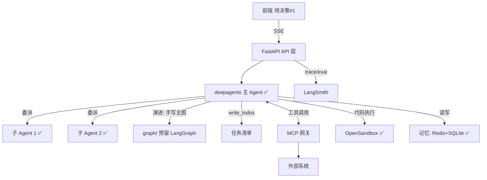

# 多 Agent 项目 — 前后端架构目录 v2（拍板版）

> 📋 **规范**：遵循 `docs/文档规范.md`
> 📌 **更新时间**：2026-08-02
> 🔄 **最近三次改动**：
> 
> | 版本 | 日期 | 改动 |
> |------|------|------|
> | v2.3 | 2026-08-02 | Docker 编排落地：docker-compose + 资源限额 + LangSmith Key |
> | v2.2 | 2026-08-02 | 环境策略拍板：OpenSandbox/Redis 云端化，配置驱动切换 |
> | v2.1 | 2026-08-02 | 前端拍板 React 19 + shadcn；OpenSandbox 查证关闭 |
> 
> **目录**：
> - §0 格式规则
> - §1 总体架构
> - §2 目录树
> - §3 基础设施
> - §4 启动与部署
> - §5 工程经验映射
> - §6 决策记录与待决策
> - §7 开工前置条件
> - §8 待办
> - §9 勘误与修正记录

---

> 定位：下一个项目 = **多 Agent 系统**。核心拍板：**deepagents 搭建主体，LangGraph 手写图作为演进路径**；**沙箱用 OpenSandbox**；**部署走 CI runner 远程**；**路径按运行环境自适应**。
> 本文档是**搭建执行蓝图**：拍板项已固化，未决项在第 6 节高亮——最终按此文档由 AI 搭建框架。
> 来源：①`harness 学习-梳理.md`（需求与概念）②当前项目 `llm_wiki_selfbuild`（单体 Agent 实战经验）③image 1 采购项目模板（多 Agent 参考）。

---

## 0. 格式规则

1. **拍板项**在第 6 节「决策记录」固化；**未决项**在第 6 节「待你决策」高亮（⚠️ 待决策）
2. 版本记录：v1 待审核 → v2 拍板 → v3 定稿（接口签名细化）
4. 工程经验用 📌 标注来源（当前项目踩坑 / image 1 / 通用实践）
5. 标识约定：🔧 已修正 / ⚠️ 存疑待核实 / 【推断】解读性推测 / 📊 经验估算 / ✅ 已拍板

## 版本表

| 版本 | 日期 | 内容 |
|------|------|------|
| v1 | 2026-08-02 | 初版架构目录：分层 + 目录树 + 基建 + 工程经验映射，待审核 |
| v1.1 | 2026-08-02 | 自省修订：①决策点节号修正 ②决策点 1 组合表述修正（deepagents 是整体 harness 非子 Agent 库）③沙箱 5 态不再编造第 3 态 ④补 llm/ 适配层与 auth/ ⑤补 CI ⑥内存标注经验估算 |
| v2 | 2026-08-02 | 拍板固化：①决策点 1-4/6-8 已拍板 ②架构主线改为 deepagents + LangGraph 演进预留 ③沙箱 OpenSandbox ④部署 CI runner + 路径自适应 ⑤待决策项高亮（前端框架/业务场景/OpenSandbox 本地模式） |
| v2.1 | 2026-08-02 | ①前端拍板方案 A（React 19 + shadcn 复用）②业务暂缓，技术架构先行 ③OpenSandbox 查证：确系阿里开源（Apache 2.0），可自托管，待决策 #3 关闭 ④新增第 7 节「开工前置条件清单」（可勾选） |
| v2.2 | 2026-08-02 | 环境策略拍板：①**OpenSandbox 不本地部署，直接云端**（本地/生产都连云端沙箱）②**Redis 同理云端**——环境分离改为「配置驱动切换」，.env.dev/.env.prod 双配置，同一套 docker-compose ③第 7 节清单调整：OpenSandbox/Redis 本地部署项移除 |
| v2.3 | 2026-08-02 | Docker 编排落地：①docker-compose.yml 已建（redis + opensandbox 服务，backend 占位）②OpenSandbox server 官方镜像 opensandbox/server + 挂载 docker.sock + deploy/opensandbox/sandbox.toml 配置 ③资源限额适配 2核4g（redis 256m / sandbox 512m / backend 1g）④.env 补 SANDBOX_PORT / REDIS_PASSWORD ⑤LangSmith Key 已配置验证 |

---

## 1. 总体架构

```
┌─────────────────────────────────────────────────────────┐
│ 前端 Vue3 + Vite (浏览器)                                 │
│   ChatView ── 对话流 + 工具/参数/结果 三栏 + SSE 流式      │
└──────────────┬──────────────────────────────────────────┘
               │ /api/chat/stream (SSE) /api/history ...
┌──────────────▼──────────────────────────────────────────┐
│ 后端 FastAPI (ASGI)                                      │
│   api/  路由层 · 鉴权 · 中间件(日志/限流) · SSE 出口       │
│   ┌─────▼────────────────────────────────────────────┐  │
│   │ Agent 层 ✅ deepagents 主线 + LangGraph 演进预留 │  │
│   │   主 Agent ── 委派 ──► 子 Agent ×2（声明式 YAML） │  │
│   │   任务清单 write_todos · 人工审批 · 压缩 summarizer│  │
│   │   graph/ 预留：后续手写主图（Send API 平行）       │  │
│   └─────┬──────────────┬──────────────┬─────────────┘  │
│   ┌─────▼─────┐ ┌──────▼──────┐ ┌─────▼───────┐        │
│   │ MCP 网关  │ │ 沙箱 ✅     │ │ 记忆/存储    │        │
│   │ FastMCP   │ │ OpenSandbox │ │ Redis(短期)  │        │
│   │ 外部系统  │ │ 本地替身待定 │ │ SQLite(长期) │        │
│   └───────────┘ └─────────────┘ └─────────────┘        │
│   LangSmith 监控(trace/eval) · 结构化日志 · 配置中心      │
└─────────────────────────────────────────────────────────┘
```

- **依赖单向**：api → agent → {mcp, sandbox, memory, db}，禁止反向（沿用当前项目规范 📌）
- **模型多 provider**：deepseek / 豆包 / 智谱，LLM 适配层统一接口（当前项目 config.py 已有此模式 📌）



---

## 2. 目录树（前后端完整）

```
multi-agent-project/
├── frontend/                       # 前端 ✅ React 19 + shadcn/ui + Tailwind 4（复用 wiki-ui-v2）
│   ├── src/
│   │   ├── pages/
│   │   │   └── ChatPage.tsx        # 主界面：对话流 + 工具/参数/结果 三栏
│   │   ├── api/
│   │   │   ├── client.ts           # SSE 封装（ai SDK，复用本项目模式）
│   │   │   └── types.ts            # 与后端共享的类型（事件协议）
│   │   ├── components/
│   │   │   ├── ToolCallPanel.tsx   # 工具调用展示（工具/参数/结果）
│   │   │   ├── AgentTree.tsx       # 多 Agent 调用链可视化（主→子，vis-network 复用）
│   │   │   ├── ApproveDialog.tsx   # 人工审批弹窗
│   │   │   └── HistorySidebar.tsx
│   │   ├── lib/                    # shadcn 工具（复用）
│   │   └── main.tsx
│   ├── vite.config.ts              # proxy /api → localhost:8000
│   └── package.json
│
├── backend/                        # 后端 FastAPI (ASGI)
│   ├── src/
│   │   ├── api/                    # Web 层
│   │   │   ├── main.py             # FastAPI 入口（CORS、路由注册）
│   │   │   ├── chat.py             # /api/chat/stream (SSE)、resume 断点恢复
│   │   │   ├── history.py          # 会话 CRUD
│   │   │   ├── auth/               # 鉴权（当前项目 src/core/auth/ 迁移 📌；纯本地 demo 可后置）
│   │   │   ├── middleware.py       # 日志/限流/PII 中间件
│   │   │   └── agent_loader.py     # Agent 单例 + 生命周期管理
│   │   ├── agent/                  # Agent 层 ★核心 ✅ deepagents 主线
│   │   │   ├── main_agent.py       # deepagents 主 Agent（AGENTS.md 操作手册）
│   │   │   ├── subagents/          # 声明式子 Agent（YAML 配置，起步 2 个）
│   │   │   │   ├── analyst.yaml    # ✅ 示例：分析专家
│   │   │   │   └── executor.yaml   # ✅ 示例：执行专家
│   │   │   ├── planner.py          # 任务规划（write_todos 落地）
│   │   │   ├── summarizer.py       # 对话压缩（超阈值摘要，绝不做 todo 摘要）
│   │   │   ├── approve.py          # 人工审批（interrupt/resume）
│   │   │   ├── graph/              # ✅ 演进预留：LangGraph 手写主图
│   │   │   │   ├── state.py        #   State 定义（TypedDict/Pydantic）
│   │   │   │   └── graph.py        #   节点/边/条件分支/并行 Send API
│   │   │   ├── memory/             # 记忆模块
│   │   │   │   ├── short_term.py   # Redis：对话/任务计划/审批断点
│   │   │   │   ├── long_term.py    # SQLite/向量库：历史结论/用户偏好
│   │   │   │   └── profile.py      # 用户画像提取+注入
│   │   │   ├── middlewares/        # Agent 中间件栈
│   │   │   │   ├── logging.py      # 每步 trace（输入/工具/输出/耗时）
│   │   │   │   ├── retry.py        # 重试/熔断
│   │   │   │   └── pii.py          # 敏感信息拦截
│   │   │   └── skills/             # Skill 体系（SKILL.md + 渐进式加载）
│   │   ├── mcp/                    # MCP 网关层
│   │   │   ├── server.py           # FastMCP server 注册
│   │   │   ├── registry.py         # 工具分类注册表
│   │   │   ├── http_base.py        # httpx AsyncClient（连接池/超时）
│   │   │   └── tools/              # 各业务工具集（按域分包）
│   │   ├── sandbox/                # 沙箱层 ✅ OpenSandbox（本地替身待决策#3）
│   │   │   ├── adapter.py          #   统一接口：create/exec/upload/download
│   │   │   ├── opensandbox.py      #   OpenSandbox 实现（注入 SANDBOX_PATH）
│   │   │   ├── local_docker.py     #   本地替身实现（Docker，待决策#3 选 B 时启用）
│   │   │   ├── health.py           # 健康检查+自动恢复
│   │   │   ├── breaker.py          # 熔断器
│   │   │   └── download.py         # 结果文件下载到本地
│   │   ├── core/                   # 基建
│   │   │   ├── config.py           # Pydantic BaseSettings（.env 多 provider）
│   │   │   ├── paths.py            # ✅ 路径自适应：get_app_dir/get_log_dir/环境探测（迁移当前项目 path_resolver 模式 📌）
│   │   │   ├── logging.py          # 结构化日志 + 请求追踪 ID
│   │   │   ├── langsmith.py        # 监控接入（trace + eval）
│   │   │   ├── errors.py           # 异常分级 + 统一错误响应
│   │   │   └── security.py         # 路径校验/权限工具
│   │   ├── llm/                    # LLM 适配层（当前项目 src/llm/ 模式迁移 📌）
│   │   │   ├── adapter.py          # 统一接口：chat / chat_structured
│   │   │   ├── providers.py        # deepseek / 豆包 / 智谱 多 provider 切换
│   │   │   └── retry.py            # 超时 + 重试（LLM 调用必须加）
│   │   ├── db/                     # 数据访问层（参数化 SQL，无拼接）
│   │   └── models/                 # 全项目 Pydantic 实体模型（禁裸 dict）
│   ├── tests/                      # 分层测试
│   │   ├── test_agent/  test_api/  test_mcp/  test_sandbox/
│   │   └── conftest.py             # mock LLM、tmp_path、:memory:
│   ├── scripts/                    # 启动/运维脚本
│   │   ├── dev.sh                  # 一键启动（后端+前端+沙箱）
│   │   ├── seed_skills.py          # skill 下载→测试→分配
│   │   └── smoke_test.py           # 冒烟测试
│   ├── .env.example                # 配置模板（密钥不入库）
│   ├── langgraph.json              # LangGraph 图注册（build_agent 入口）
│   ├── pyproject.toml              # 依赖管理
│   └── docker-compose.yml          # 本地+云端统一编排
│
├── deploy/                         # 部署
│   ├── nginx.conf                  # 前端静态托管 + /api 反代
│   └── .env.prod                   # 生产配置
└── docs/                           # 文档
    ├── AGENTS.md                   # Agent 全局操作手册
    └── learnings/                  # 踩坑笔记（延续当前项目 .learnings 习惯）
```

---

## 3. 基础设施（一开始就搭，不后补）

| 基建 | 选型 | 为什么第一天就做 |
|------|------|------------------|
| **监控** | LangSmith（trace + eval） | 没有 trace，多 Agent 出问题就是瞎猜；trace 链能看到主→子的委派路径 📌 |
| **日志** | 结构化日志 + 请求追踪 ID 贯穿全链 | 多 Agent 并发下靠 tracing ID 串起一次请求的完整调用链 |
| **配置** | Pydantic BaseSettings + .env（多 provider：deepseek/豆包/智谱） | 当前项目已验证模式 📌 |
| **启动脚本** | `scripts/dev.sh` 一键起三件（后端/前端/沙箱） | 新机器 5 分钟可跑；`docker compose up` 本地=云端一致 |
| **持久化** | Redis（短期）+ SQLite/向量库（长期） | 当前项目教训：**纯 MemorySaver 无持久化 → 冷启动全丢，后来补 SQLite 很痛** 📌 |
| **测试** | pytest + mock LLM + 分层目录 | 当前项目 149 测试是回归安全网，多 Agent 更复杂更需要 📌 |
| **错误处理** | 异常分级 + 统一错误响应（200/400/403/404/500） | 当前项目 api/errors.py 模式 📌 |
| **安全** | 工具路径前缀校验 + PII 拦截中间件 | 当前项目安全规则直接迁移 📌 |
| **CI（可选）** | GitHub Actions：pytest + lint + 构建 | 当前项目已有 deploy.yml 📌；demo 阶段可后置 |

---

## 4. 启动脚本草案

```bash
# scripts/dev.sh — 一键开发环境
# 1. 后端
uvicorn src.api.main:app --reload --port 8000 &
# 2. 前端（Vite，proxy /api → 8000）
cd frontend && npm run dev &
# 3. 沙箱（Docker，带资源限额）
docker compose up -d sandbox
# 4. 健康检查：curl localhost:8000/api/health
```

```bash
# 生产（2核4g）docker-compose 服务编排 📊（经验估算，需压测校准）
services:
  backend:     # FastAPI + Agent，memory 1g，cpus 1.5
  frontend:    # nginx 静态托管，memory 64m
  sandbox:     # 沙箱池，--memory 512m --cpus 0.5，预热 2 实例上限
  redis:       # 短期记忆，memory 256m
```

### 4.3 部署流程（✅ 拍板：提交项目 → runner 远程部署）

```
本地开发（dev.sh 或 docker compose）──► git commit + push
    ──► 触发 CI runner（提交自动拉取）
    ──► 构建镜像 + 跑测试（pytest）
    ──► 部署到云服务器（docker compose up -d）
```

- **阶段一（现在）**：本地验证基础论证——docker compose 本地跑通全链路（OpenSandbox/Redis 连云端）
- **阶段二（后续手动推进）**：接 runner 自动远程部署
- **路径自适应（拍板要求）**：不写死常量路径——`core/paths.py` 运行时探测环境（本机 / 云 / 其他机器），数据目录 / 日志目录 / 沙箱凭据全部通过环境探测 + .env 注入（迁移当前项目 `path_resolver.py` 的 get_app_dir / get_log_dir / is_frozen 模式 📌）

### 4.4 环境配置切换（✅ v2.2 拍板：配置驱动，双 .env）

```bash
# 同一套代码 + 同一份 docker-compose.yml，只换 .env
.env.dev        # 本地开发：模型 keys、云端 SANDBOX_URL、云端/本地 REDIS_URL
.env.prod       # 云端：生产 keys、云端 SANDBOX_URL、云 REDIS_URL

# 本地跑（读 .env.dev）
docker compose --env-file .env.dev up

# 云端跑（读 .env.prod）
docker compose --env-file .env.prod up -d
```

核心原则：**OpenSandbox 与 Redis 不本地部署，两端都指向云端**（v2.2 拍板）——本地只跑应用代码，日志/断点本地可见便于排查；云端只跑应用 + 连云资源。环境差异仅剩 keys/URL，由 .env 隔离。

---

## 5. 工程经验映射（当前项目 → 新项目）

### A. 架构分层（已合规的继续用）

| 经验 | 来源 📌 | 新项目动作 |
|------|---------|-----------|
| 依赖单向：main → core → {tools, llm, db} | 当前项目规范 | 新分层：api → agent → {mcp, sandbox, memory} |
| Agent 四层：perception / planning / action / memory | 当前项目 src/agent/ | 演化为：planner / graph / tools / memory，保留分层心智 |
| 路由 /v1/ 前缀 + Pydantic 请求响应模型 | 当前项目规范 | 直接沿用 |

### B. Agent 状态机（最大的一笔经验）

> 当前项目图结构演进：`纯 MemorySaver → +SQLite 持久化 → +approve 人工审批 → +summarizer 压缩`（devlog-2026-07-27 📌）

| 踩坑 | 教训 | 新项目第一天就做 |
|------|------|------------------|
| 无持久化，冷启动对话全丢 | 持久化是地基不是可选 | Checkpointer（SQLite）从第一个 commit 就有 |
| 工具调用直接放行 | 高影响操作必须人批 | approve/interrupt 节点内置在主图 |
| 长对话 token 爆 | 压缩必须内置且**绝不对任务清单做摘要** | summarizer 节点 + write_todos 原文保留 |
| 旧摘要残留 Bug（P3 遗留） | 压缩状态要可追踪 | 压缩事件协议前后端对齐（EVENT_SUMMARIZE） |
| 前端不知道 Agent 内部状态 | 事件协议要在第一天定 | SSE 事件类型表（token/工具/审批/压缩/子Agent） |

### C. 数据与安全

| 经验 | 来源 📌 | 新项目动作 |
|------|---------|-----------|
| dict 裸返回 → 统一 Pydantic 模型 | 记忆：数据模型规范化整改 | **新项目直接从模型层开始，禁裸 dict** |
| 全量 N² 计算进高频路径 | 记忆：增量计算教训 | 子 Agent 结果合并/检索用增量 + 缓存 |
| 路径前缀校验防穿越 | 当前项目安全规则 | 工具层强制校验，沙箱再加一层 |
| LLM 调用超时+重试 | 当前项目规范 | 统一 LLM 适配层封装 |

### D. MCP 与工具（复盘经验）

| 经验 | 来源 📌 | 新项目动作 |
|------|---------|-----------|
| MCP 单例 + 装饰器注册 | 记忆：MCP server 复盘 | registry.py 从第一天就是注册表模式 |
| HTTP 双模式（流式/非流式） | 同上 | mcp http_base 统一 httpx 池 |
| 异常分级（可重试/不可重试） | 同上 | 错误码体系 + 重试策略分等级 |

### E. 开发流程

| 经验 | 来源 📌 | 新项目动作 |
|------|---------|-----------|
| 核心代码手写，样板 AI 提速 | 记忆：手写训练纪律 | LangGraph 图/State 手写，胶水 AI |
| 文件 ≤750 行关注 / ≤1000 拆分 | 记忆：开发流程约定 | 目录结构预留拆分位 |
| 提交前先给计划等确认 | 记忆：提交前确认 | 沿用 |
| 踩坑记 .learnings | 当前项目 | docs/learnings/ 延续 |
| 测试红绿先行 + mock LLM | 当前项目规范 | 沿用 |

### F. 多 Agent 专项预防（新项目新坑，提前防）

| 风险 | 预防 |
|------|------|
| 子 Agent 结果污染主上下文 | 子 Agent 独立上下文，**只回结构化结论**（image 2 经验） |
| 子 Agent 结果无法解析 | 子 Agent 强制结构化输出 schema 校验 |
| 并行子任务资源竞争 | Send API 并行上限 + 沙箱并发限额 |
| 子 Agent 跑偏/遗忘目标 | write_todos 原文随任务下发 |
| 多 Agent trace 混乱 | 请求追踪 ID + LangSmith trace group 贯穿 |

---

## 6. 决策记录与待决策

### 6.1 决策记录（✅ 已拍板，固化进架构）

| # | 决策点 | 拍板结果 | 架构影响 |
|---|--------|----------|----------|
| 1 | **Agent 层组合** | ✅ **先用 deepagents 搭建主体**，后续拓展用 LangGraph 手写主图 | 主线：deepagents harness（AGENTS.md + 声明式子 Agent）；`agent/graph/` 目录预留，演进路径：deepagents → LangGraph 手写图（Send API 平行） |
| 2 | 子 Agent 数量 | ✅ 先做 **2 个** | subagents/ 起步 2 个 YAML（analyst + executor），后续追加 |
| 3 | 子 Agent 拓扑 | ✅ 起步**主从**，后续拓展**平行**差异化 | 先 supervisor-worker 委派；graph/ 演进期引入 Send API 平行路径 |
| 4 | 业务演示场景 | ✅ **暂缓**：先开发技术架构，业务后接（架构与业务解耦，业务可快速拓展） | 子 Agent YAML/MCP 工具集留到业务定后填充；技术栈先行不阻塞 |
| 5 | **前端框架** | ✅ **方案 A：沿用 React 19 + shadcn/ui + Tailwind 4**（复用本项目 wiki-ui-v2 组件） | frontend/ 目录按 React 展开：组件/图谱(vis-network)/流式(ai SDK) 复用；图谱可视化沿用 |
| 6 | **沙箱** | ✅ **OpenSandbox**（阿里开源，github.com/alibaba/OpenSandbox，Apache 2.0）——**不本地部署，直接云端** | sandbox/ 层改为 OpenSandbox 适配（adapter + opensandbox 实现，多语言 SDK + 统一 API）；**本地开发与生产都连云端 OpenSandbox**（SDK 指向云端地址，本地不装 Docker 沙箱运行时）；含 MCP Server 集成；⚠️ 云端部署细节以官方 README 为准 |
| 7 | 数据库 | ✅ **Redis + SQLite** | 短期记忆 Redis、长期 SQLite；向量检索后续可加 |
| 8 | **部署** | ✅ **提交项目触发 runner 远程部署**；先本地验证基础论证 | 新增 CI runner 部署流程；**路径自适应**（见 4.3）：本机/云/其他机器均可运行，路径与读取不写死常量 |
| 9 | **环境策略** | ✅ **配置驱动切换**：本地一套 + 生产一套，**.env.dev / .env.prod 双配置**；OpenSandbox 与 Redis **都连云端**（不本地部署） | 同一份代码 + 同一份 docker-compose.yml，只换 .env 指向不同 REDIS_URL / SANDBOX_URL / LLM keys；本地访问方便排查问题（日志/断点），云端环境一致最小化差异 |

### 6.2 待你决策（⚠️ 高亮，影响搭建开工）

| # | 待决策 | 选项 | 我的建议 | 影响 |
|---|--------|------|----------|------|
| **3** | OpenSandbox 本地开发模式 | ✅ **已关闭（v2.2 拍板）：不本地部署**——本地与生产**都连云端 OpenSandbox**（已有云环境，SDK 指向云端地址即可），不装本地 Docker 沙箱 | 开发/生产环境差异最小化；云端部署细节开工时按官方 README 落地 | 沙箱层实现 |

---

## 7. 开工前置条件清单（你逐项勾选 ✅）

### 7.1 开发阶段（开工前）

✅ **Python 3.11+** — 已有
✅ **Node.js + pnpm** — 已有（当前项目在用）
✅ **Docker Desktop** — 已有（本地）
✅ **DeepSeek API Key** — 已有（当前项目 .env）
✅ **豆包 / 火山方舟 Key** — 已有（config.py 的 ark_）
✅ **LangSmith API Key**（监控，唯一必缺）— langsmith.com 注册，免费额度，约 5 分钟
- [ ] **云端 OpenSandbox 部署**（已在云环境上部署 OpenSandbox 服务端，SDK 连云端地址）— 开工时我协助落地
✅ **Git 仓库初始化**（GitHub 私有仓库，部署 runner 需要）
- [ ] **环境配置双份**：`.env.dev`（本地）+ `.env.prod`（云端），同一套 docker-compose 切换
 -----------云环境----------
### 7.2 部署阶段（本地验证通过后再做）

- [ ] **云服务器**：2核4g（阿里云 ECS / 腾讯云轻量），准备账号 + 密码/密钥 + 公网 IP — 已有 ✅ 使用云上 OpenSandbox + Redis
✅**域名**（可选，演示公网访问好看；不买可用 IP:端口）
- [ ] **生产 .env 副本**：模型 API Key 在服务器上再填一份（密钥不入 git）
- [ ] **LangSmith Key 生产配置**
- [ ] **OpenSandbox 生产形态**（云端已部署，配置 SANDBOX_URL 指向即可）
- [ ] **云 Redis**（短期记忆云端化，配置 REDIS_URL 指向）
- [ ] **阿里云实名认证**（云资源前提）
✅ **CI runner 配置**（GitHub Actions，提交自动部署）

### 7.3 费用参考 📊（经验值）

| 项 | 费用 |
|----|------|
| 模型 API（DeepSeek/豆包/智谱） | 按量，demo 阶段几元 |
| LangSmith | 免费额度足够 |
| OpenSandbox | 开源免费（自托管） |
| 云服务器 2核4g | ~50-100 元/月 |
| 域名 | ~10-60 元/年（可选） |

---

## 8. 待办

| 优先级 | 事项 | 状态 |
|--------|------|------|
| P0 | 前置条件清单 7.1 逐项勾选（实际只缺 LangSmith Key） | ⏳ 你挨个做 |
| P0 | 勾选完成后细化 v3：目录树 → 模块接口签名（State/SSE 事件表/MCP 注册/记忆读写） | 待做 |
| P1 | 前端事件协议表（SSE 事件类型定义） | v3 附 |
| P1 | 子 Agent YAML 配置样例初稿 | v3 附 |
| P1 | Docker 配置（Dockerfile ×4 + compose + .env.example） | 拍板后随搭建产出 |
| P1 | 上云命令清单（本地验证通过后） | 阶段二 |

---

## 9. 勘误与修正记录（自省）

> 标识约定：🔧 已修正 / ⚠️ 存疑待核实 / 📊 经验估算

| 位置 | 问题 | 处置 | 版本 |
|------|------|------|------|
| 格式规则 | "决策点在第 7 节"与实际（第 6 节）不符 | 🔧 已修正 | v1.1 |
| 决策点 1 组合方式 A | "deepagents 子 Agent harness"表述错误——deepagents 是**整体 harness**，不能单独拆作子 Agent 库 | 🔧 改为"手写主图+手写子 Agent（Send API）+ 借鉴声明式设计"，补充 langgraph-supervisor 选项 B | v1.1 |
| 目录树 sandbox/manager.py | "5态：预热→缓存→回收"——**"回收"系编造**，OCR 原文仅显示"预热→缓存" | 🔧 已删除编造内容，标注"完整 5 态 OCR 截断，以原图为准" | v1.1 |
| 目录树 core/ | **遗漏 LLM 适配层**（当前项目 src/llm/ 是成熟模式：统一接口/多 provider/超时重试） | 🔧 已补 llm/ 目录 | v1.1 |
| 目录树 api/ | **遗漏鉴权模块**（当前项目 src/core/auth/ 存在） | 🔧 已补 auth/，标注本地 demo 可后置 | v1.1 |
| 基建表 | 未提 CI（当前项目已有 GitHub Actions deploy.yml） | 🔧 已补 CI（可选） | v1.1 |
| docker-compose 内存 | 经验值非实测 | 📊 已标注 | v1.1 |
| 决策点 8 | 实际是"确认项"非决策项 | ⚠️ 保留但仅作确认，不计入取舍 | v1.1 |
