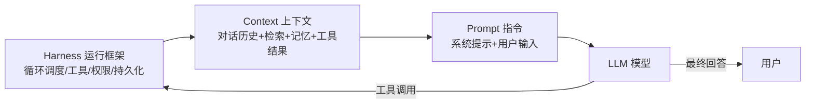
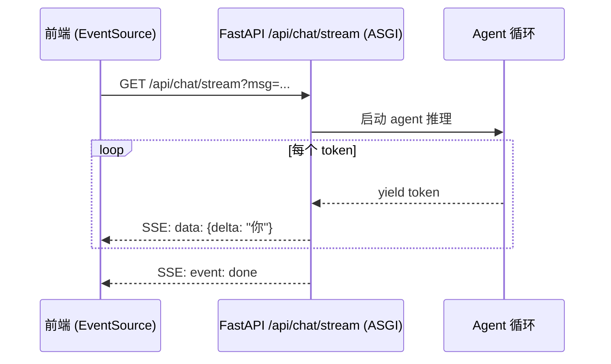
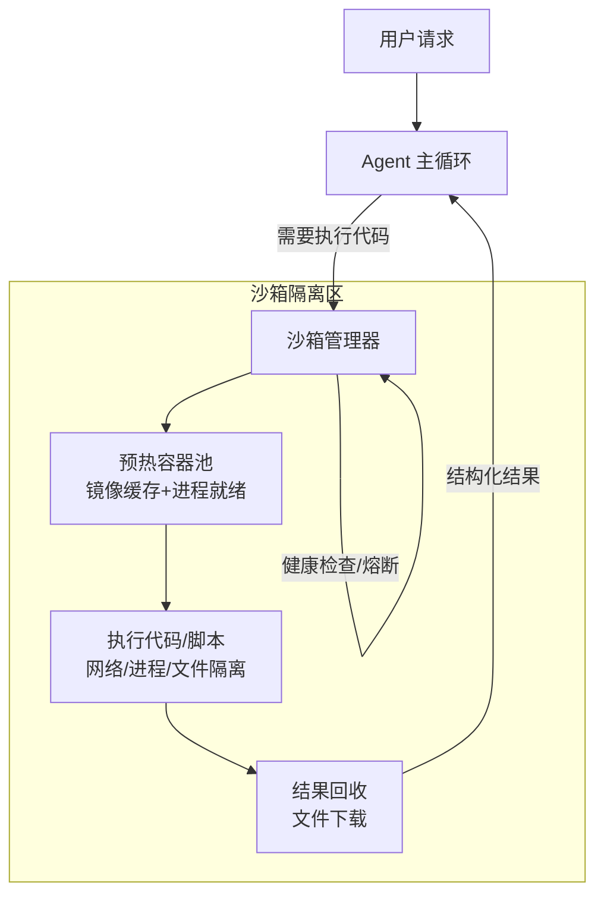
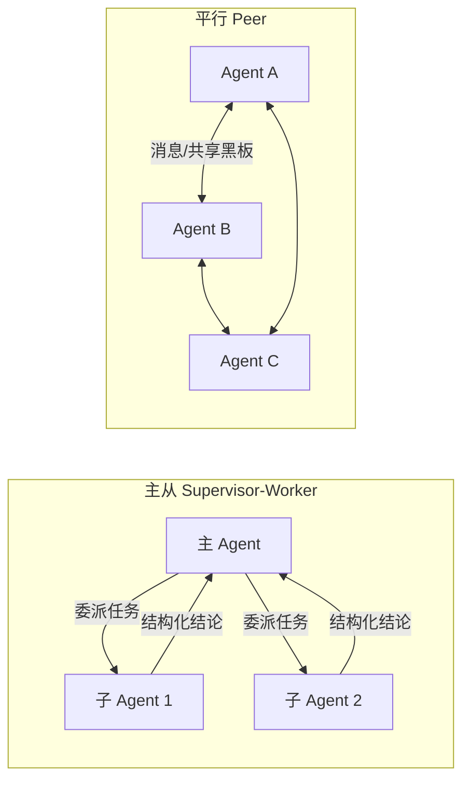
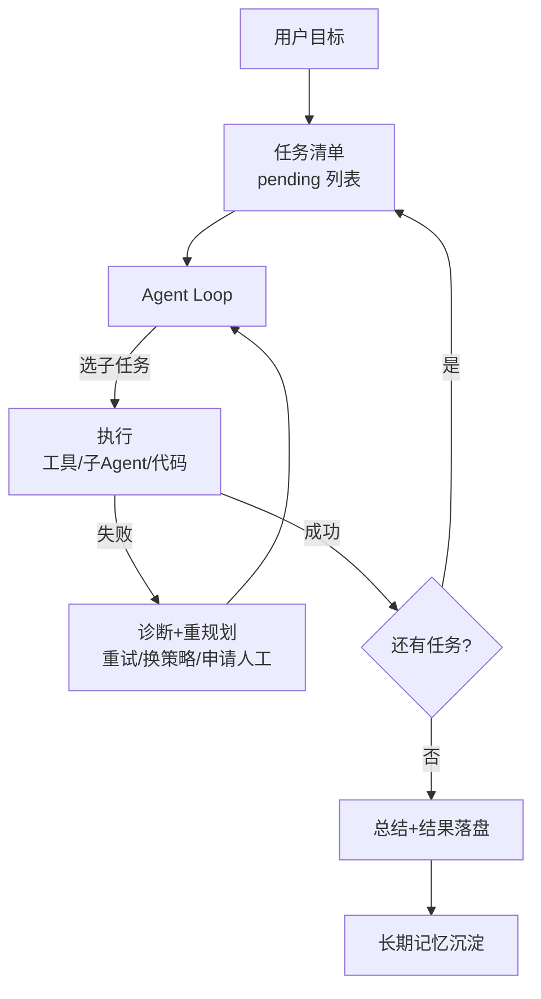
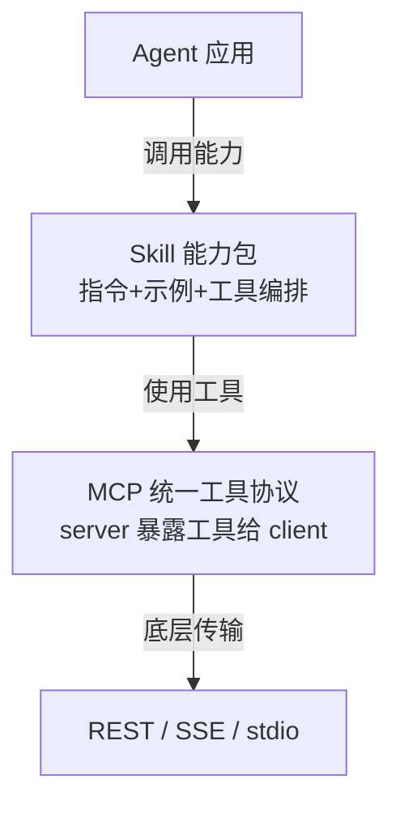
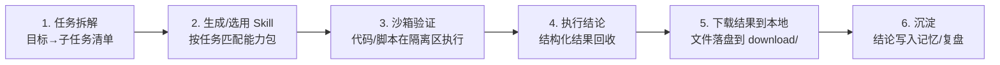

# harness 学习 — 梳理与回答 v4

> 📋 **规范**：遵循 `docs/2026-08-02-文档规范.md`
> 📌 **更新时间**：2026-08-02
> 📝 **版本变更记录**（永久保存，只追加不删除）：
> 
> | 版本 | 日期 | 具体改动（精确到二级标题） |
> |------|------|------|
> | v6 | 2026-08-02 | 目录迁移：移入 `docs/学习/`；§0 格式规则更新（版本记录改文档头永久保存）；§3 图片引用路径更新为 `docs/图片和附件/`；正文版本表并入文档头 |
> | v7 | 2026-08-06 | 治理阶段 2 合并：本文件（梳理版）承接《harness 学习.md》原始口述笔记全部内容（问题 1-8、核心技能、技术架构、岗位搜索、非学习杂项等均已被 §2 A-H 分类 + §3 OCR 覆盖），原笔记删除；文件按 §6.2 改名 `学习-harness-v1.md`（v1 为治理命名，正文内容为 v7） |
> | v5 | 2026-08-02 | §1 目录升级：每个二级问题一行（主题+编号+问题+优先级+状态），新增「拒绝」勾选列（[x]=剔除）与「备注」补充列 |
> | v4 | 2026-08-02 | §2 自检修订：①标题版本号校正 ②正文修正/存疑处打标识（🔧 已修正 / ⚠️ 存疑待核实 / 【推断】）③新增第 6 节「勘误与修正记录」④E1 标注 OCR 重建风险 ⑤C1 标注参考项目证据链 |
> | v3 | 2026-08-02 | §2 框架选型更新：①修正 C1（deepagents 出品方 LangChain，非 Anthropic）②补充 deepagents v0.5 新特性（async subagents / write_todos 内置 / SKILL.md 标准）③AutoGen 合并为 Microsoft Agent Framework ④新增 AgentScope 对比 ⑤完整选型决策逻辑 |
> | v2 | 2026-08-02 | §2 目录改表格；全部问题逐条回答；概念补全；三张图片 OCR 提取内容；复杂概念配 mermaid 流程图 |
> | v1 | 2026-08-02 | 初版梳理：散乱问题归入 8 大主题，标注优先级，建立目录 |
> 
> **目录**：
> - §1 目录
> - §2 分类问题详情与回答
> - §3 图片内容提取
> - §4 流程图索引
> - §5 待办清单
> - §6 勘误与修正记录

---

> 本文件是原始口述笔记（原 `harness 学习.md`，2026-08-06 治理合并入本文件）的结构化梳理 + 逐条回答。
> 原始散乱问题 → 分类（P0/P1/Px）→ 回答 → 概念补全 → 流程图说明。

## 0. 格式规则（写在最前面）

1. **优先级分级**：P0（学习主线，必答必学）> P1（工程落地细节）> Px（非学习杂项）
2. **文档结构固定**：规则 → 目录（表格） → 分类问题详情（至少一级/二级）→ 图片提取 → 流程图（版本记录统一在文档头，永久保存）
3. **版本记录**：文档头「📝 版本变更记录」永久保存，每条具体到二级标题（遵循 `docs/2026-08-02-文档规范.md` §3）
4. **问题保持口述原味**：不改写原意，补充解读用【 】标注
5. 原文位置用 `§行号` 标注，便于回溯；"📌 回答"为本次补全内容

---

## 1. 目录

> 用法：**拒绝列**打 `x`（`[x]`）= 该问题你不认可/不需要，做剔除标记；**备注列**自由补充（存疑、补充、指向新问题等）。二级问题详情见第 2 节对应编号。

| 主题 | 编号 | 二级问题 | 优先级 | 状态 | 拒绝 | 备注 |
|------|------|----------|--------|------|:----:|------|
| A 基础概念 | A1 | prompt / context / harness 的区别？ | P0 | ✅ | [ ] | |
| A 基础概念 | A2 | ASGI 后端服务是什么？流式输出如何暴露给前端？ | P0 | ✅ | [ ] | |
| A 基础概念 | A3 | transformer 架构了解？ | P0 | ✅ | [ ] | |
| B Agent 核心技能 | B1 | 任务规划（ReAct / Plan-and-Execute / 任务清单） | P0 | ✅ | [ ] | |
| B Agent 核心技能 | B2 | 沙箱：隔离/预热/逃逸/OpenSandbox/自研 vs 托管 | P0 | ✅ | [ ] | |
| B Agent 核心技能 | B3 | 用户、用户记忆、用户画像？ | P0 | ✅ | [ ] | |
| B Agent 核心技能 | B4 | 人工介入（HITL） | P0 | ✅ | [ ] | |
| B Agent 核心技能 | B5 | Skill：mcp 接入/自研/市场/AI 生成 | P0 | ✅ | [ ] | |
| B Agent 核心技能 | B6 | 项目 swagger ui 获取测试样例？ | P0 | ✅ | [ ] | |
| B Agent 核心技能 | B7 | 子智能体：主从 vs 平行？如何通讯？ | P0 | ✅ | [ ] | |
| B Agent 核心技能 | B8 | 中间件 / 拦截器 / 钩子函数 | P0 | ✅ | [ ] | |
| B Agent 核心技能 | B9 | 计划执行能力（分解/循环/重规划/可解释/抗遗忘） | P0 | ✅ | [ ] | |
| C 框架选型 | C1 | 多智能体框架怎么选？（LangGraph/Deep Agents/CrewAI/MAF/AgentScope） | P0 | ✅ | [ ] | |
| C 框架选型 | C2 | 接入 langsmith？（监控能力） | P0 | ✅ | [ ] | |
| C 框架选型 | C3 | 接入协议：mcp / skill / http？ | P0 | ✅ | [ ] | |
| C 框架选型 | C4 | dify 定位（只能处理简单任务？） | P0 | ✅ | [ ] | |
| D 任务流程 | D1 | 任务流程 5 步（拆解→skill→沙箱验证→结论→下载） | P0 | ✅ | [ ] | |
| D 任务流程 | D2 | write_todos 约定（固话目标，不做摘要） | P0 | ✅ | [ ] | |
| E 项目架构 | E1 | 项目代码结构参考（image 1 模板） | P1 | ✅ | [ ] | |
| E 项目架构 | E2 | 前端：vue？UI 框架？套壳 vs 自研？ | P1 | ✅ | [ ] | |
| E 项目架构 | E3 | 后端技术栈（FastAPI/ASGI/MCP/多模型/Java ERP） | P1 | ✅ | [ ] | |
| E 项目架构 | E4 | 启动与运行（前端/后端/沙箱；本地+云端） | P1 | ✅ | [ ] | |
| E 项目架构 | E5 | 部署：2核4g 上云，Docker 管理沙箱？ | P1 | ✅ | [ ] | |
| F 开发策略 | F1 | 从 0 到 1 还是找开源项目套壳？ | P1 | ✅ | [ ] | |
| F 开发策略 | F2 | 业务与技术耦合？（技术先行） | P1 | ✅ | [ ] | |
| G 行业资料 | G1 | 多智能体官方文档资料 | P1 | ✅ | [ ] | |
| G 行业资料 | G2 | 岗位调研（boss 直聘大模型要求） | P1 | ✅ | [ ] | |
| G 行业资料 | G3 | 简历样式（同学简历模板） | P1 | ✅ | [ ] | |
| G 行业资料 | G4 | 我之前项目是不是没有做 skill？（复盘） | P1 | ✅ | [ ] | |
| H 非学习 | H1 | AI 日报/时政/热搜推送手机 | Px | 🟡 | [ ] | |
| H 非学习 | H2 | 狗狗训练转圈 | Px | 🟡 | [ ] | |

---

## 2. 分类问题详情与回答

### A. 基础概念（P0）

#### A1. prompt / context / harness 的区别？【§29 第一个问题-1】

📌 回答：三者是不同层级的抽象，经常被混用：

| 概念 | 是什么 | 例子 |
|------|--------|------|
| **prompt（提示词）** | 直接给模型的**指令文本**：系统提示词 + 用户输入 + 工具定义 | "你是采购分析专家，遇到 X 时做 Y" |
| **context（上下文）** | 模型一次推理能看到的**全部信息**：对话历史、检索文档、工具结果、记忆、当前任务状态 | 前 20 轮对话 + 供应商数据 + 用户画像 |
| **harness（运行框架）** | 模型**之外的执行环境**：循环调度（Agent Loop）、工具调用、权限控制、沙箱、状态持久化、重试/错误处理 | Claude Code、LangGraph Runtime、你自己写的 Agent 骨架 |

一句话：**harness 管理 context，context 里包含 prompt，prompt 决定模型怎么想**。你笔记里 image.png 提到的 "Context Engineering, Harness Engineering, Skills, Sandboxes" 正是 2025-2026 年 Agent 工程化的四个主流方向——工程重点已经从"写 prompt"转移到"搭 harness"。



#### A2. ASGI 后端服务是什么？【§146】

📌 回答：**ASGI = Asynchronous Server Gateway Interface**，Python 异步 Web 标准（WSGI 的继任者）。FastAPI 就是基于 ASGI 的框架。

- WSGI 是同步的（一个请求一个线程），ASGI 支持**异步 + 长连接**（WebSocket / SSE / HTTP 流式）
- 智能体流式输出 = 后端 async generator 逐 token 产出 → 通过 **SSE（Server-Sent Events）** 推送 → 前端 `EventSource` 逐字接收
- 你的参考项目（image 1）就是 `/api/chat/stream (SSE)、resume` 这个模式——resume 指中断后可恢复



#### A3. transformer 架构了解？【§110】

📌 回答：与 image.png 配套。学习目标分三级，面试建议到第 2 级：

1. **能用**：知道它是"注意力机制"堆叠的神经网络，自回归生成（一个 token 一个 token 预测下一个）
2. **能讲**：Q/K/V 注意力、自注意力 vs 交叉注意力、位置编码、编码器（BERT 类）/解码器（GPT 类）/编码-解码（T5 类）；能画图讲清 attention 公式含义
3. **能手推**：写过一个简化 transformer 训练 demo（学习阶段可不做，vLLM/SGLang 源码阅读属于第 3 级进阶）

> 建议：结合 image.png 的学习路径——Transformer 是地基，Pytorch 是工具，微调（SFT/LoRA/P-tuning）和推理部署（vLLM/SGLang）是工程化，最后才是 Agent/RAG。

---

### B. Agent 核心技能（P0）

#### B1. 任务规划？（§49）

📌 回答：Agent 把用户目标拆成可执行步骤的能力。三种主流范式：

| 范式 | 思路 | 适用 |
|------|------|------|
| **ReAct** | 推理→行动→观察 循环，边做边想 | 短任务、需要工具交互 |
| **Plan-and-Execute** | 先出完整计划，再逐步执行（可中途重规划） | 长任务、多步骤 |
| **任务清单（task list）** | 维护 pending/in_progress/completed/failed 状态清单，逐步推进 | 复杂业务任务（你的参考简历里就是这种） |

落地要点：计划要**写进上下文/状态**（参考 §287 write_todos），而不是只靠模型"记住"。

#### B2. 沙箱（§51-58）

📌 回答：沙箱 = 隔离的代码/脚本执行环境，是 Agent 安全执行代码的边界。

**为什么需要**：Agent 执行用户请求时可能要跑 Python 代码、操作文件、访问网络——不能直接放行，否则代码注入 = 主机被攻破。

**方案对比**：

| 方案 | 类型 | 特点 |
|------|------|------|
| Docker 容器 | 进程隔离 | 最常用，开销中等，2核4g 可用 |
| gVisor / Firecracker | 轻量虚拟化 | 安全隔离更强，云厂商标准做法 |
| **OpenSandbox（阿里开源）** 🔧 | 开源沙箱平台（Apache 2.0，github.com/alibaba/OpenSandbox） | ✅ 确系阿里开源（2025-12，CNCF Landscape）；**可自托管**：内置 Docker/K8s 运行时、多语言 SDK（Python/Java/JS/C#/Go）、gVisor/Kata/Firecracker 强隔离、MCP Server 集成；image 1 项目用其封装；官方文档以英文为主（开源惯例），中文解读资料有 |
| E2B / Modal / Daytona | 国外托管沙箱 | 云上即用，国内访问/合规要评估 |

**几个概念的纠正**：
- **LangSmith AgentCore 不是沙箱**⚠️【推断待核实】——按我的理解它是 Agent 运行时/框架层（执行编排），沙箱只是它可调度的组件之一；此说法基于概念推理，未查一手文档，学习时以官网为准
- **企业"自己的沙箱"**：大厂一般自研或深度定制（安全合规要求），小团队用云厂商托管（阿里 OpenSandbox、百度千帆沙箱）或 Docker 自建。你优先用自己的沙箱 ✅ 方向正确——面试差异化点
- **沙箱逃逸/突破权限**（你提到的引申）：2025 年确实有多起 Agent 沙箱安全事件与披露⚠️【细节待核实】——具体案例名/厂商我未逐一查证，但"沙箱非绝对安全"是行业共识——所以才有"主机+沙箱双层文件访问平面"（image 2 简历）这种纵深防御设计

**沙箱预热机制**：容器冷启动慢（秒级-10秒级），预热 = 提前创建容器/缓存镜像、进程池就绪，请求来了直接用。image 1 里"沙箱生命周期管理（5态：预热→缓存→…）"就是这个——面试高频考点。



#### B3. 用户、用户记忆、用户画像？（§59）

📌 回答：记忆分三层（面试必答）：

| 层级 | 存储 | 内容 |
|------|------|------|
| **短期记忆** | 会话上下文 / Redis | 当前对话、任务计划、审批断点、临时数据 |
| **长期记忆** | 向量库 / 数据库（Milvus、MongoDB） | 历史结论、常用模板、用户偏好 |
| **用户画像** | 偏好库 | 从交互中提取并持久化（image 1: "用户偏好自动提取+持久化"） |

落地模式（参考 image 1/2）：
- 对话消息 → 短期存储（Redis / MongoDB）
- 会话结束 → 总结沉淀 → 长期库（Milvus 向量检索）
- 用户画像 → 每次请求注入上下文（`context_injection.py` + UserPreferences）
- 跨会话恢复：`user_skills_restore.py`（重启后恢复技能和上下文）

#### B4. 人工介入（§61）

📌 回答：Human-in-the-loop（HITL），高风险动作必须人批准。实现模式：

1. **审批工具**：Agent 遇到高影响操作（下单、改规则、删数据）调用审批工具 → 阻塞等待 → 人同意/拒绝 → 继续或终止（image 1: `hitl_tools.py` 的 request_order_info）
2. **中断/恢复（interrupt/resume）**：LangGraph 的 Checkpointer 支持：执行到断点暂停 → 人介入修改 → 恢复执行
3. **灰度确认**：规则变更先小范围灰度，人确认后才全量（image 2 简历的做法）

#### B5. Skill（§63-71）

📌 回答：Skill = 可复用的"能力包"（指令 + 示例 + 工具定义 + 上下文，打包成一个单元）。Skill 比工具高一阶：工具是单个能力，Skill 是"完成一类任务的完整方法"。

四种来源（你的清单 ✅）：

| 来源 | 说明 |
|------|------|
| **MCP 接入** | 外部 MCP server 暴露工具，作为 skill 的工具底座 |
| **自己开发** | 自定义功能，Markdown 说明 + Python 实现（image 1: skills 库"Markdown + Python 渐进式加载"） |
| **市场获取** | Clawhub 等 skill 市场，下载现成 skill |
| **让 AI 生成** | 口述需求 → AI 产出 skill 骨架 → 你审查修改（`assign_skill.py`: 下载→创建→测试→分配→持久化） |

生命周期（参考 image 1 的 `skills_sync.py` / `assign_skill.py`）：**下载 → 创建 → 测试 → 分配 → 持久化 → 跨会话恢复**。面试重点：skill 怎么"渐进式披露"（不把全部 skill 塞进上下文，按需加载）——控制 token 消耗的关键。

#### B6. 项目 swagger ui 获取测试样例？（§73）

📌 回答：可行且常用——**用现有后端的 OpenAPI/Swagger 自动生成工具定义和测试数据**：

- 启动后端 → `/docs`（Swagger UI）→ 拿到全部接口的 OpenAPI schema
- 自动生成 MCP 工具定义（参数、返回结构）→ Agent 直接对接现有 API（image 1: MCP 工具加载"本地 ERP + ModelScope"，`mcp_tools_bean.py` 就是做工具分类注册）
- Swagger 页面本身就是测试样例集：可以直接 curl 每个接口验证

意义：**让 Agent 无需写一行对接代码就能使用已有后端能力**——这就是 MCP 网关的价值（image 1: "MCP 网关 — Agent → Java ERP"）。

#### B7. 子智能体？（§75-77）

📌 回答：先分清两种拓扑（你明确想做的差异化点）：



- **主从（supervisor-worker）**：主流、易实现。主 Agent 拆任务 → 委派子 Agent → 收集结构化结论（image 1/2 都是这种：特征分析 Agent、规则配置 Agent、测试验证 Agent……）。**马士兵那类课程基本都是主从模式**【推断：基于你笔记"马士兵是子智能体"的解读，未核实其课程内容】
- **平行（peer-to-peer）**：多 Agent 对等协作，通过消息传递/共享状态通信，如 AutoGen group chat、LangGraph 的 Send API、共享黑板模式。**你做平行 = 差异化** ✅ 但注意：平行架构的"价值"在真实业务里需要场景支撑（如多角色辩论、并行调查），纯演示价值有限——面试时能讲清"为什么平行"比"做了平行"更重要

**智能体如何通讯**：直接函数调用 / 消息队列（共享状态）/ MCP 桥接（一个 agent 的工具是另一个 agent 的 server）/ 共享文件系统。LangGraph 原生支持 Send API + State 共享；Deep Agents v0.5 的 async subagents 通过 **Agent Protocol** 通信（并行 + 远程部署，天然贴近平行形态）；AgentScope 消息驱动 + A2A 协议是另一种平行路径（见 C1）。

#### B8. 中间件 / 拦截器 / 钩子函数（§79-81, §174）

📌 回答：Agent 的 AOP（面向切面），在关键节点注入横切逻辑。参考项目里的注入点（image 1/2）：

| 注入点 | 中间件职责 |
|--------|-----------|
| 模型调用前后 | 缓存、重试、token 统计、日志 |
| 工具调用前后 | 权限校验、PII 检测、结果过滤 |
| 任务状态变更 | 状态记录、审计上报 |
| 文件读写 | 敏感操作拦截 |

image 1 有 **8 个中间件**（middleware_config.py 统一配置），image 2 简历明确写了"可插拔中间件 + Hook"。这是架构面试必问项——**能说出注入点 + 具体拦截逻辑 = 加分**。

#### B9. 计划执行能力？（§180-190）

📌 回答：你列的 5 个子项本身就是标准答案，逐个落地：

| 能力 | 落地方式 |
|------|----------|
| 目标分解与结构化 | 任务清单机制（pending/in_progress/completed/failed），高层目标写进上下文（write_todos） |
| 状态驱动的执行循环 | 状态机：每步消费状态、产出状态；LangGraph State 就是干这个的 |
| 动态重规划与自我修正 | 失败检测（重试 N 次）→ 重新规划子任务 → 换工具/换策略 |
| 执行诊断可解释性 | 结构化日志（每步：输入/工具/输出/耗时/错误），可回放 |
| 长任务抗遗忘 | 中间结果落盘（虚拟文件系统/状态存储），只把摘要+链接放上下文（image 2 的上下文管理） |



---

### C. 多智能体框架选型（P0）

#### C1. 用哪个框架？deepagent 还是别的？（§241）

📌 回答（2026-08 更新）：**先纠正一个关键认知——这些框架不在同一层**：

```
LangGraph（图运行时底座，Pregel 状态机）
   └─ deepagents（LangChain 出的开箱即用 harness，跑在 LangGraph 上）
   └─ CrewAI（角色驱动，也可底层换 LangGraph）
AutoGen → 已合并进 Microsoft Agent Framework（2025-10 微软官宣）
AgentScope（阿里，消息驱动，独立体系，兼容 LangGraph）
```

所以 **"langgraph | deepagent" 不是二选一，是上下层关系**：LangGraph 是运行时，Deep Agents 是它上面的"全家桶 harness"（内置子 Agent、write_todos、SKILL.md、HITL、文件系统）。

**主流框架横向对比（2026-08）**：

| 框架 | 出品 | 编排模型 | 特点 | 生态 |
|------|------|----------|------|------|
| **LangGraph** | LangChain | 图/状态机（Node/Edge/State） | 灵活度最高、持久化/人审/流式最全，生产级事实标准 | 24.6k+ ⭐，大厂背书（Klarna/Replit/Elastic/Uber） |
| **Deep Agents** | LangChain 🔧(v3 修正：v2 误写 Anthropic) | 主管-专家 + 内置 harness | 声明式 YAML 子 Agent（AGENTS.md）、内置 write_todos / SKILL.md / interrupt_on；**v0.5 新增 async subagents（并行+远程+Agent Protocol 通信）**；模型无关（DeepSeek/豆包/智谱都能用） | MIT 开源 |
| **CrewAI** | 社区 | Role/Goal/Task 角色协作 | 上手最快（半天出 demo），API 0.x 变动频繁，企业级能力有限 | 社区活跃，适合原型 |
| **AutoGen → Microsoft Agent Framework** | Microsoft | 会话/群聊 | 2025-10 与 Semantic Kernel 合并为 MAF（2026-02 RC），原 AutoGen 独立开发已停 | 微软生态 |
| **AgentScope** | 阿里通义 | 消息驱动 + Actor 模型 | 三层架构（框架/Runtime/Studio），原生 A2A 协议，分布式/容错/多模态，国产化企业级 | 3k+ ⭐（偏小），集成 ModelScope，中文文档 |
| OpenAI Agents SDK | OpenAI | Handoff（交接） | 官方轻量 | OpenAI 生态 |
| Google ADK | Google | 多 Agent 编排 | 官方较新 | Google 生态 |

**决策逻辑（按你的情况逐条推）**：

| 决策维度 | 你的情况 | 结论 |
|----------|----------|------|
| 学习成本 | 已有 langchain/langgraph 基础 | → **LangGraph** 迁移成本最低（状态机心智一致） |
| 项目模板 | image 1 参考项目自称 DeepAgent（OCR 自述"Agent 层 － DeepAgent 核心"）⚠️ 但 create_main_agent 是 langgraph-supervisor 的 API，两者关系需以项目源码为准 | → **Deep Agents** 与你的代码模板大概率对齐（AGENTS.md 声明式子 Agent 特征吻合），抄模板时留意 API 出处 |
| 面试市场 | 国内 JD 高频词：LangGraph / 多智能体 / MCP | → 主线必须是 **LangGraph**（市场认知度最高） |
| 差异化（平行智能体） | 不想只做主从 | → deepagents v0.5 **async subagents**（并行委派）+ AgentScope **A2A/消息驱动**是两条平行路径，可作谈资 |
| 国内部署 | deepseek/豆包/智谱 + 2核4g | → Deep Agents 模型无关 ✅；AgentScope 国内合规强但生态小、学习曲线陡 |
| 写代码自由度 | 要自己写核心逻辑 | → LangGraph 最不锁人（少抽象多控制） |

**最终建议（v3 拍板）**：
- **主线：LangGraph**（精学，面试主打）
- **第二技能：Deep Agents**（用 image 1 模板做项目时自然学到，声明式子 Agent + 内置 harness 是加分叙事）
- **对比谈资：AgentScope（国内对标）、CrewAI（上手快）、Microsoft Agent Framework（AutoGen 去向）**——能讲清差异即可，不精学
- 不要贪多：面试只讲深 1 个 + 能对比 3 个，就是最优形态

#### C2. 接入 langsmith？（§243）

📌 回答：**建议项目一开始就接入监控**，理由：
- LangSmith（或 Langfuse 等开源替代）提供：trace 链路、token 成本、评分 eval、prompt 管理
- 排查 Agent 问题（哪一步错了、上下文超了、工具调用失败）没有 trace 就是瞎猜
- 成本低、接入 10 分钟，越晚接入回溯越难
- 面试点：能讲"我上线前就配置了 trace + eval"是加分项

#### C3. 接入协议：mcp / skill / http（§33）

📌 回答：三层协议栈，**不是互斥，是层级关系**：



- **HTTP**：最底层传输，任何服务都能暴露 REST API
- **MCP**：工具层的统一协议（Model Context Protocol）——解决了"每个 agent 对接每个 API 都要写适配器"的问题。MCP server 把任意后端包装成标准工具（image 1: 本地 ERP、ModelScope、Java ERP 都通过 MCP 接入）
- **Skill**：比工具更高的抽象——组合多个工具 + 指令 + 工作流，完成一类任务

你的判断 ✅：**"协议接口用 mcp 或者 skill 调用 http 都可以"** —— MCP server 内部用 HTTP 调后端，skill 内部编排 MCP 工具。

#### C4. dify 定位（§31）

📌 回答：**dify 是低代码 LLM 应用平台**（拖拽编排、自带知识库/工作流/Agent 节点）。"只能处理简单任务"的判断基本成立：
- 适合：业务人员快速搭 RAG 问答、简单工作流、Demo 验证
- 不适合：复杂 Agent 逻辑（长任务规划、多 Agent 协作、深度定制）、需要写代码的差异化能力
- 定位参照：**dify 类是"可视化套壳"，LangGraph 类是"代码框架"**——你要做差异化项目，走代码框架路线是对的

---

### D. 任务流程理解（P0）

#### D1. 任务流程片段验证（§84-94）

📌 回答：你记的 5 步流程**方向正确**，这是"沙箱型 Agent"的标准闭环，稍微修正细化：



对照参考项目验证 ✅：image 1 里 `assign_skill.py`（技能分配：下载→创建→测试→分配→持久化）+ `sandbox_setup.py`（沙箱创建+环境初始化）+ `download/`（报告下载目录）完全对上这 5 步。你的理解是对的，可以放心。

#### D2. write_todos 约定（§287）

📌 回答：✅ 正确且重要的工程实践：
- **write_todos 把高层目标固化在上下文中**：Agent 每轮都看到完整目标清单，防止长任务中跑偏/遗忘
- **绝对不能做摘要**：摘要有损压缩，会丢细节导致执行偏差；目标要原文完整保留（这是"长任务抗遗忘性机制"的落地手段之一，见 B9）
- 实现：任务状态（pending/in_progress/completed/failed）放持久化状态（Checkpointer/数据库），每轮循环读回

---

### E. 项目架构与工程（P1）

#### E1. 项目代码结构参考（§160-207）

📌 回答：**image 1（采购分析 Agent 项目）就是你现成的结构样例**，OCR 提取的完整目录如下（可直接当模板）：

> ⚠️【OCR 重建声明】本目录树由 OCR 文本按坐标（y 行序 + x 缩进）重建，**层级父子关系为推断，个别文件归属可能有偏差**；文件名与注释来自原图，但结构以原图/项目源码为准。

```
src/
├── api_view/            # Web 层 — FastAPI 对外服务
│   ├── web_main.py      #   FastAPI 应用入口（CORS、路由注册）
│   ├── web_config.py
│   ├── chat.py          #   /api/chat/stream (SSE)、resume
│   ├── history.py       #   /api/history CRUD + 消息存取
│   └── agent_loader.py  #   AgentLoader 单例（生命周期管理）
├── agent/               # Agent 层 — DeepAgent 核心
│   ├── main_agent.py    #   ★ 主入口 create_main_agent()⚠️(langgraph-supervisor API) + precompute_agent_context()
│   ├── AGENTS.md        #   Agent 全局操作手册（226 行）
│   ├── prompts.py       #   主 Agent 系统提示词
│   ├── subagents/       #   子 Agent 配置（声明式 YAML）
│   │   ├── procurement_analyst.yaml  # 采购分析专家
│   │   └── procurement_order.yaml    # 采购订单专家
│   ├── configs/loader.py             # YAML 加载 + 工具名解析
│   ├── memory/          # 记忆模块
│   │   ├── memory_update.py
│   │   ├── context_injection.py      # 用户上下文注入
│   │   ├── skills_sync.py            # 本地技能同步到沙箱
│   │   ├── assign_skill.py           # 技能分配（下载→创建→测试→分配→持久化）
│   │   ├── tools_summarization.py
│   │   └── user_skills_restore.py    # 持久化技能恢复
│   ├── middlewares/     # 中间件栈（8 个）
│   │   ├── middleware_config.py
│   │   ├── hitl_tools.py             # HITL 人工介入
│   │   └── ...（缓存/重试/日志/PII 等）
│   ├── tools/           # 工具层
│   │   ├── mcp_client.py             # MCP 工具加载（本地 ERP + ModelScope）
│   │   ├── web_search.py             # 智谱搜狗 Web 搜索
│   │   ├── chart_generator.py        # 26→1 图表工具合并
│   │   ├── sandbox_health.py         # 沙箱健康检查+自动恢复
│   │   └── sandbox_breaker.py        # 沙箱熔断器
│   └── mcp_tools_bean.py             # MCP 工具分类 Bean
├── mcp_server/          # MCP Server 层（FastMCP）— MCP 网关 Agent→Java ERP
│   ├── server_main.py
│   ├── server_config.py #   ERP 后端地址 + MCP 监听配置
│   ├── http_base.py     #   httpx AsyncClient（连接池、超时）
│   ├── custom_opensandbox.py         # OpenSandbox 封装（注入 SANDBOX_PATH）
│   ├── sandbox_setup.py              # 沙箱创建 + Python 环境初始化
│   ├── sandbox_proxy.py              # 代理层（热替换，18 个方法显式委托）
│   ├── sandbox_manager.py            # 沙箱生命周期（5态：预热→缓存→…）
│   ├── download_sandbox_file.py      # 沙箱文件下载到本地
│   └── tools/
│       ├── parts_tools.py            # part_query / part_search
│       ├── order_tools.py            # order_create / order_update / order_search_details
│       ├── inventory_tools.py        # inventory_warning MCP 工具
│       ├── suppliers_tools.py        # supplier_query MCP 工具
│       ├── procurement/              # 采购分析操作手册
│       ├── supplier-price-urls/      # 供应商报价 URL 映射
│       ├── skill-management/         # 技能管理 SKILL.md + 渐进式加载
│       ├── web-scraper/              # 沙箱内网页抓取
│       └── chart_params.md           # 26 种图表参数速查
├── download/            # 报告下载目录（Agent 生成 report_*.md）
├── skills/              # 技能库（Markdown + Python，渐进式加载）
│   ├── main/  ├── procurement-analysis/  ├── web-content-fetcher/  └── supplier-price-urls/
├── test/                # 测试
│   ├── test_all_tools.py   # 全工具测试
│   ├── test_mcp.py         # MCP 连接测试
│   └── agent_test.py       # Agent 集成测试
└── 数据模型/配置
    ├── ProcurementContext / UserPreferences / ChatRequest
    ├── MongoDB 连接配置 / .env 环境变量加载
    └── env_utils.py / log_utils.py
```

关键设计模式提炼（面试点）：
- **分层清晰**：Web 层（FastAPI）→ Agent 层（DeepAgent）→ MCP Server 层（FastMCP）→ 沙箱层（OpenSandbox）→ 外部系统（Java ERP）
- **Java ERP 对接**：MCP 网关模式——ERP 的接口包成 MCP 工具，Agent 只认识工具不认识 HTTP
- **沙箱独立一层**：`sandbox_*` 六个文件（manager/proxy/setup/health/breaker/download）说明沙箱是核心基础设施不是附属品

#### E2. 前端（§33, §140-144, §225-233）

📌 回答：
- **框架**：Vue 3 + Vite（国内生态、你问的"简单使用"✅ 上手快）。UI 库：Element Plus（成熟）或 Naive UI（更现代）
- **套壳 vs 自研**：如果只是展示 Agent 对话+工具调用，可以套开源壳（Open WebUI / LobeChat）；**但如果要展示"工具/参数/结果"三栏（你 §225-233 的界面需求），套壳改造成本可能高于自研一个简单面板**——建议自研轻量壳（一个聊天页 + 工具调用可视化）
- 界面三要素：**工具**（调用了哪个工具）、**参数**（传入什么）、**结果**（返回什么）——这就是 agent 透明化展示，面试演示很加分

#### E3. 后端（§146-156）

📌 回答：你的技术栈清单基本就是标准答案，逐个确认：

| 组件 | 选型 | 说明 |
|------|------|------|
| 后端入口 | **FastAPI**（ASGI） | ✅ 流式输出基础，见 A2 |
| 流式输出 | SSE（`/api/chat/stream`） | ✅ 参考项目同款 |
| MCP | **MCP server（FastMCP）** | 作为代理 api 网关，包一层 Java ERP / 外部服务 |
| 沙箱 | **OpenSandbox**（阿里） | 国内方案 ✅，或 Docker 自建 |
| 模型 | **deepseek + 豆包 + 智谱** | ✅ 多 provider 切换，LLM 适配层统一接口 |
| 业务系统 | **Java ERP 模拟** | MCP 网关对接，业务可替换（换 MySQL/其他也行） |

架构一句话：**FastAPI 入口 + ASGI 流式 → Agent 编排 → MCP 网关 → Java ERP / 沙箱 / 模型多 provider**。

#### E4. 启动与运行（§35-39, §214）

📌 回答：三套启动脚本（开发环境）：

```bash
# 1. 启动后端（FastAPI）
uvicorn src.api_view.web_main:app --reload --port 8000

# 2. 启动前端（Vite dev server，代理 /api → localhost:8000）
npm run dev   # 前端 :5173，配置 vite proxy 到后端

# 3. 启动沙箱（OpenSandbox 本地模拟 or Docker）
docker compose up sandbox   # 或 python -m src.mcp_server.sandbox_manager
```

- **本地和云端都支持** ✅：用 Docker Compose 统一环境（见 E5），本地 `docker compose up`，云端同镜像部署
- 开发期建议后端 --reload + 前端热更新 + 沙箱按需创建（不常驻）

#### E5. 部署：2核4g 上云（§263）

📌 回答：2核4g 够用，但要精打细算（**LLM 在 API 侧，不在你服务器上，这是关键前提**）：

> 📊【经验估算】下表为业界常见经验值，非精确测量，以实际压测为准。

| 组件 | 内存估算 | 说明 |
|------|----------|------|
| FastAPI + Agent | ~300-500MB | 应用主体，轻量 |
| MCP server | ~200MB | 工具网关 |
| 沙箱（Docker） | 每实例 256-512MB | **必须设内存上限**（docker run --memory），防止脚本跑飞拖垮宿主机 |
| 前端（静态构建） | Nginx 托管 ~50MB | 构建产物直接 nginx serve |
| 数据库 | 外部托管或 ~200MB | SQLite/MongoDB 看量级 |

方案：**Docker Compose 编排**，沙箱服务独立容器 + `--memory 512m --cpus 0.5` 限额 + 预热池上限 2-3 个实例。**核心原则：应用和沙箱分容器，沙箱必须限额**——面试必考"沙箱怎么防资源耗尽"。

---

### F. 开发策略（P1）

#### F1. 从 0 到 1 还是找开源项目？（§98-102）

📌 回答：结合你的目标（学习 + 面试 + 差异化），建议**混合路线**：

1. **骨架套开源**：找一个多 Agent 开源项目（或参考 image 1 的架构模板）做壳——UI、基础框架不重复造轮子
2. **核心自研**：你差异化的部分（平行智能体、沙箱管理、技能系统）自己写——面试讲的是这部分
3. **模拟业务需求**：给前端壳配一个模拟页面需求/开发样例（如采购分析：输入"分析供应商报价"→ 显示工具调用过程 + 参数 + 结果），demo 演示闭环
4. **最简化**：只扩展你的增量功能 ✅——"技术栈打底 + 单业务场景闭环"就是面试最优形态

#### F2. 业务与技术（§269）

📌 回答：✅ 同意你的判断：**前中期以技术为主，业务后接入**。Agent 项目技术栈（Agent 编排/沙箱/技能/记忆/MCP）与具体业务耦合度低——image 1 采购、image 2 风控、你做的任意业务，架构层都一样。先搭通用能力，业务只作为"演示场景"接入即可。

---

### G. 行业与学习资料（P1）

#### G1. 官方资料（§41）

📌 回答：多智能体官方文档清单（学习路线按此顺序）：

| 资源 | 地址 | 优先级 |
|------|------|--------|
| LangGraph 官方文档 | langchain-ai.github.io/langgraph | ★★★ 主学 |
| deepagents | github.com/langchain-ai/deepagents | ★★★ 参考项目同款 |
| OpenAI Agents SDK | openai.github.io/openai-agents-python | ★★ 对比 |
| CrewAI | docs.crewai.com | ★ 对比 |
| MCP 协议 | modelcontextprotocol.io | ★★★ 必学 |
| Anthropic Agent 工程化手册 | anthropic.com/engineering | ★★★ 概念权威 |

#### G2. 岗位调研（§116-120）

📌 回答：boss 直聘调研是**实操任务**（需要联网搜 JD），建议方法：
1. 关键词：`Agent 开发` / `大模型应用` / `LLM 工程师` / `AI 应用开发`
2. 抓取 10 个 JD 的技能要求 → 归纳高频词（预计集中在：LangGraph/多智能体、RAG、MCP/工具调用、Prompt 工程、部署经验）
3. 对照你的学习计划查漏补缺
> 🔧 待办：我可以做一轮 WebSearch 调研主流大模型岗位 JD 要求，汇总成技能对照表——需要时喊我。

#### G3. 简历（§124）

📌 回答：**image 2 就是你同学的真实简历，是最佳模板**——它的写法值得逐句模仿：

| 简历模块 | 参考写法（image 2 原文提炼） |
|----------|------------------------------|
| 项目描述 | 后端采用 **FastAPI + ASGI** 实现高性能服务，集成 Java 接口扩展能力，围绕**XX 复杂任务构建 AgentHarness** |
| 核心实现 | ①**运行时能力层**：任务规划、虚拟文件系统、子 Agent 委派、上下文管理、可插拔中间件、Skills 技能系统、持久化记忆 ②**任务清单机制**（pending/in_progress/completed/failed）③**虚拟文件系统**（/workspace /reports /logs /policies /memories + 版本留痕）④**上下文管理**（大结果落盘，仅摘要+链接进上下文，减少 token 提升长任务稳定性）⑤**子 Agent 独立上下文**（仅返回结构化结论，降低主上下文污染）⑥**可插拔中间件**（模型/工具/文件/状态节点 Hook：缓存、重试、日志、PII 检测、权限校验、审计上报）⑦**Skills 渐进式披露** ⑧**Redis 短期 + Milvus 长期记忆**（跨会话恢复）⑨**安全沙箱**（OpenSandBox 主机+沙箱双层平面，网络/进程/文件隔离 + 人工审批保障灰度安全）⑩**链路追踪**（Kafka 审计上送） |
| 业务价值 | 完成从业务问题输入到策略验证、审批材料生成、结果分析的**闭环** |

要点：**"能力清单式"写法（每个能力=一句带技术名词的短句）+ 技术栈前置 + 价值收尾**。你的项目做出 3-4 个这样的能力点就够撑起简历。

#### G4. 我之前项目是不是没有做 skill？（§43）

📌 回答：**是的，确认没有**。查证 `llm_wiki_selfbuild` 项目：现有架构是 `WikiCompiler`（Ingest/Query/Lint 三大编排操作）+ 四个工具类（ReadTool/WriteTool/SearchTool/LintTool），工具是硬编码类，没有 Skill 概念（没有 skill 目录、没有 skill 加载/分配机制）。
- 这也是你新项目的差异化点：**旧项目无 Skill → 新项目补上完整 Skill 体系**，面试能讲"我踩过没有 skill 的坑，所以新架构做了 X"

---

### H. 非学习杂项（Px）

#### H1. AI 日报推送（§132, §277）【🟡 待安排】

📌 想法可行：定时任务（cron）+ 抓取 AI 日报/时政/热搜源 → LLM 摘要 → 推送手机（Server酱/企业微信/钉钉机器人 webhook）。与学习主线无关，作为独立小工具排在 Px。

#### H2. 狗狗训练转圈（§136）【🟡 待安排】

📌 生活事项，与本学习文档无关，单列备忘。

---

## 3. 图片内容提取（OCR 结果）

> 三张图片通过 OCR 提取（原图在 `docs/图片和附件/`，OCR 原始输出见 `docs/图片和附件/ocr_result.txt`）

### 图 1：image.png — AI 大模型的工程化落地方向

```
AI 大模型的工程化落地方向：
├── Agent: Context Engineering, Harness Engineering, Skills, Sandboxes
├── RAG: 向量数据库、多链路召回、切片、重排、评估、问题重写
├── 后端部署、Agent、RAG 评估
├── Transformer 架构、理解神经网络、理解和使用 Pytorch
├── 大模型的推理和部署：vLLM、SGLang（包括理解源码）
├── 掌握各种微调算法（SFT、LoRA、P-tuning）
├── LangChain + LangGraph + DeepAgents
└── Vibe coding 工具：Codex、Claude Code 熟练其中一个
```

含义：**学习路线全景图**——Transformer/微调/推理部署是模型侧，LangChain+LangGraph+DeepAgents 是应用侧，Vibe coding 工具是效率侧。你的项目走"应用侧 + Vibe coding"路线。

### 图 2：image 1.png — Agent 核心代码架构（采购分析项目）

含义：**一个真实生产级 Agent 项目的完整目录 + 分层注释**（详见 E1 完整树）。核心分层：Web 层（FastAPI）→ Agent 层（DeepAgent，主 Agent + 声明式子 Agent YAML + 8 中间件 + 记忆/技能/工具模块）→ MCP Server 层（FastMCP 网关，对接 Java ERP + OpenSandbox 沙箱）→ download/ 报告输出 → skills/ 技能库 → test/ 测试。亮点：沙箱 5 态生命周期管理、沙箱熔断器、HITL、技能同步/恢复、26→1 图表工具合并、MCP 工具分类 Bean。

### 图 3：image 2.png — 同学简历（风控策略 AgentHarness）

含义：**真实简历样例**（详见 G3 完整提炼）。项目：FastAPI+ASGI 风控策略运维 AgentHarness；能力覆盖：任务规划、虚拟文件系统、子 Agent 委派、上下文管理、可插拔中间件、Skills 技能系统、Redis+Milvus 记忆、OpenSandBox 双层沙箱、Kafka 链路追踪。

---

## 4. 流程图索引

| 图 | 位置 | 说明 |
|----|------|------|
| prompt/context/harness 关系 | A1 | 三层抽象关系 |
| ASGI 流式输出时序 | A2 | SSE 推送链路 |
| 沙箱隔离与预热 | B2 | 沙箱管理器架构 |
| 主从 vs 平行多智能体 | B7 | 两种拓扑对比 |
| 计划-执行-重规划循环 | B9 | Agent 长任务循环 |
| 协议分层（HTTP/MCP/Skill） | C3 | 接入协议层级 |
| 沙箱型任务流程 | D1 | 5 步闭环验证版 |

---

## 5. 待办清单

| 优先级 | 事项 | 状态 |
|--------|------|------|
| P0 | C1 框架选型拍板（LangGraph 主线 + Deep Agents 第二技能） | ✅ 已拍板（v3） |
| P0 | 学习路线排期（Transformer → 微调/推理 → Agent） | 待排 |
| P1 | G2 岗位 JD 调研（WebSearch 汇总技能对照表） | 待做 |
| P1 | 前端壳方案决策（自研轻量 vs 套开源） | 待定 |
| Px | AI 日报推送小工具 | 待安排 |

---

## 6. 勘误与修正记录

> 标识约定：🔧 = 已修正（事实错误）；⚠️ = 存疑/待核实（无法一手验证或基于推断）；【推断】 = 对原文的解读性推测。

| 位置 | 问题 | 处置 | 版本 |
|------|------|------|------|
| C1 表格 Deep Agents 出品方 | v2 误写为 Anthropic，实为 **LangChain** 出品 | 🔧 已修正 + 表格内打标 | v3 |
| 文档标题 | 标题停留在 v2，实际内容已到 v3 | 🔧 已修正为 v4 | v4 |
| E1 main_agent.py 注释 | `create_main_agent()` 实为 **langgraph-supervisor** 的 API，与 deepagents 的 `create_deep_agent` 不同源；项目自称 DeepAgent，两者关系存疑 | ⚠️ 已在注释与 C1 决策表打标 | v4 |
| B2 LangSmith AgentCore 定义 | "AgentCore 是运行时/框架层"为概念推断，未查一手文档 | ⚠️ 已打标【推断待核实】 | v4 |
| B2 沙箱逃逸事件 | "Anthropic 披露沙箱逃逸"事件存在但具体案例/厂商细节未逐一查证 | ⚠️ 已打标【细节待核实】 | v4 |
| B7 马士兵课程 | "马士兵那类课程基本都是主从模式"是基于笔记的解读，未核实其课程内容 | 【推断】已打标 | v4 |
| E1 目录树 | OCR 按坐标重建，层级父子关系为推断，可能有偏差 | ⚠️ 顶部已加【OCR 重建声明】 | v4 |
| E5 内存估算 | 经验值，非精确测量 | 📊 已标注【经验估算】 | v4 |
| C1/G1 生态数据 | 24.6k⭐ / 3k⭐ 等为 2026-08 时效数据，会过时 | 已在表头标注日期，使用前复核 | v3 |
| B2 OpenSandbox 描述 | v2 写"云沙箱服务/托管式"不准确——实为**阿里开源可自托管平台**（Apache 2.0，Docker/K8s 运行时，多语言 SDK + MCP 集成）；v2 的来源（笔记口述"阿里的沙箱"）经查证✅正确 | 🔧 已修正描述 + 补充官方仓库与能力；勘误表登记 | v4 |
