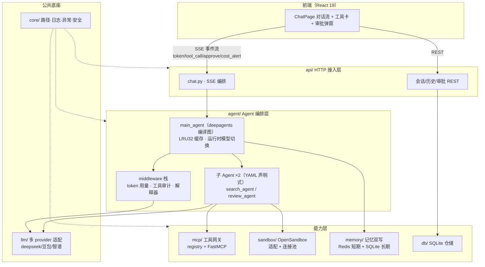
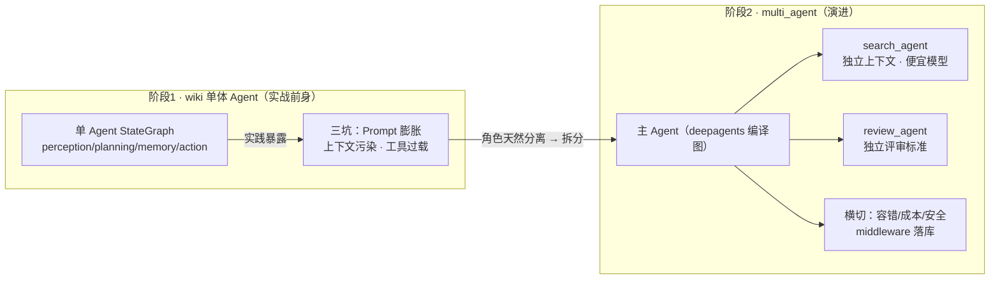

# 面试描述点-架构总纲 v1

> 📋 **规范**：遵循 `规则/文档治理规则.md`、`规则/面试描述点规则.md`（R1-R5）
> 📌 **更新时间**：2026-08-12
> 📝 **版本变更记录**（永久保存，只追加不删除）：
> | 版本 | 日期 | 具体改动 |
> |------|------|---------|
> | v1 | 2026-08-12 | 初版：后端架构总纲——广度叙事（分层 + 核心决策 + 演进路径），mermaid 静态分层图 + 动态演进图各一张，串起 22 个功能描述点 |

> **目录**：§1 总 ｜ §2 分（分层/决策/演进）｜ §3 mermaid 流程图（静态 + 动态）｜ §4 总 ｜ §5 数据弹药

> **关联**（双向）：`规则/面试描述点规则.md` ｜ `架构/多agent项目-架构目录.md`（§1 分层/§6 决策）｜ `架构/后端功能全景.md`（§1 全景）｜ `架构/参考-后端接口.md`（SSE 协议）｜ `学习/面试/2026-08-11-学习-项目追问链-v1.md`（§3 决策故事/§6 数据弹药/§7 主流程）｜ 22 个功能描述点（§2 决策逐个回链）｜ `docs/索引.md`

---

## §1 总（30s）

> "整体是**分层架构 + 依赖单向**：api → agent → {mcp, sandbox, memory, db}。主线用 deepagents harness 编译图承载编排，LangGraph 手写主图作演进预留。一次请求 = 一条 SSE 事件流贯穿全链，前端只做三件事——发起对话、展示过程、审批决策。研究型多 Agent 平台，首个落地场景是行业研究。"

---

## §2 分（广度叙事：分层 → 决策 → 演进）

### ① 分层与依赖单向

| 层 | 目录 | 职责 |
|----|------|------|
| HTTP 接入 | `api/` | 路由 + SSE 编排（chat.py）、鉴权、会话 CRUD |
| Agent 编排 | `agent/` | main_agent（编译图缓存 LRU 32）、子 Agent 委派、middleware 栈 |
| 能力层 | `mcp/` `sandbox/` `memory/` `db/` | 工具网关 / 沙箱 / 记忆双写 / SQLite 持久化 |
| 公共底座 | `core/` `llm/` `schemas/` | 配置/路径/日志/异常 / 多 provider LLM 适配 / Pydantic 模型 |

- **依赖单向**：api → agent → 能力层，禁止反向；api 禁直调 db（2026-08-12 结构重构，跨层收敛 `agent/services/` 数据服务层）
- **Agent 只编排**：出现 3 行以上业务实现（SQL/LLM 细节）→ 抽到能力目录（06-structure-optimization 纪律）
- 追问点：「为什么 api 禁直调 db？」→ 单一 SQL 出口、跨层可测、防止业务逻辑散落

### ② 核心决策五连（每个回链对应功能描述点）

| 决策 | 一句话 | 回链描述点 |
|------|--------|-----------|
| a. deepagents 主线 vs 手写 LangGraph | 主线用编译图提速，`graph/` 目录预留手写主图（演进平行智能体）| 子代理、异步子代理 |
| b. 子 Agent YAML 声明式 | 独立上下文防污染 + model 字段按任务选模型 + 最小权限模板 | 子代理 |
| c. HITL 审批 | interrupt_on 风险分级 + checkpoint 断点恢复，人工干预不破坏状态一致性 | HITL审批、断点持久化 |
| d. 记忆双写 | Redis 短期（会话/审批/运行任务）+ SQLite 长期（记忆抽取），LLM 抽取式记忆 | 记忆体系 |
| e. 三横切 | 容错（异常四分类 + 重试降级）/ 成本（token 流水 + 缓存 + 软告警）/ 安全（路径校验 + 审计）| 容错处理、成本控制、安全机制 |
| f. 多 provider LLM | deepseek/豆包/智谱统一适配 + 运行时模型切换（middleware）| 模型管理、运行时模型切换、对话流式SSE |

### ③ 演进路径（面试亮点：为什么从单体拆成多 Agent）

从 wiki 单体 Agent → multi_agent 多 Agent，三个坑驱动（详见 `项目追问链.md` §3）：
1. **Prompt 膨胀**：系统提示词要覆盖搜索/撰写/审核全部职责，互相冲突
2. **上下文污染**：搜索过程塞满对话窗口，干扰报告撰写，子任务中间结论错误迁移
3. **工具过载**：工具太多选择准确率下降（搜索/沙箱/技能描述重叠选错）

→ 拆开后：主 Agent（编排+撰写）+ search_agent（搜索专员，便宜模型）+ review_agent（审核专员，独立评审标准）——角色天然分离四前提之一。**主动讲代价**：委派 = 独立 LLM 调用，审核回路成本 +2-8×、单任务 101s→860s。

---

## §3 mermaid 流程图（R2）

### 3.1 静态：分层架构全貌（广度视角）

> 色块约定（R2）：🟦 原有主干 ｜ 🟨 横切/底座（中间件栈、core）｜ 🟥 演进预留（graph/ 手写主图——不在上图，见 3.2 演进图）。

### 3.2 动态：演进路径（wiki 单体 → multi_agent 多 Agent）

### 3.3 主流程（不重画，引用）

一次研究对话的完整数据流（6 环节 + 容错/成本/安全三横切标注）见 `学习/面试/2026-08-11-学习-项目追问链-v1.md` §7——本总纲只讲系统广度，主流程细节去追问链。

---

## §4 总（20s）

> "不是把 22 个功能点罗列——是**一条主线**：分层保证依赖单向，deepagents 编译图承载编排，SSE 事件流贯通所有横切（容错/成本/安全），演进路径证明我踩过坑（单体三坑 → 多 Agent 拆分）。每个功能点都能落到图上某个节点——面试官问任意一个，都能从总纲定位到它属于哪层、解决什么、怎么权衡。"

---

## §5 数据弹药（R3）

| 数据 | 值 | commit |
|------|-----|--------|
| 分层 | 5 层（api/agent/能力/底座/前端）+ 依赖单向 | `7eeaa7c`（结构重构）|
| 测试 | 290 用例全绿（242 基线 + 增量）| `153918f` |
| 完成率 | 90%（首跑）/ task-001 修复后 100% | `d742b0f` |
| 审核质量 | 可靠性 +1~2 分（task-001 1.0→3.0）| `cb83033` |
| 沙箱调用 | task-001 从 4 连败到成功，沙箱 66→1 次 | `a726d8b` |
| 演进三坑 | Prompt 膨胀 / 上下文污染 / 工具过载 | 详见追问链 §6 弹药库（引用不重复写）|
| SSE 事件 | 10 类事件协议（契约共享）| `6e6c094` |

> 📌 双向链接：架构真相源 `架构/多agent项目-架构目录.md`；全景 `架构/后端功能全景.md`；主流程 `项目追问链.md` §7；22 个功能描述点见 §2 决策表。
