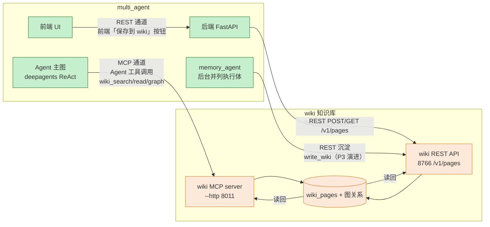
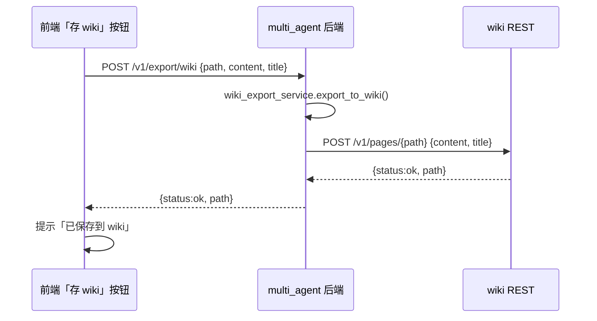

# 面试描述点-Wiki 对接 v1（multi_agent ↔ wiki 知识库 · 数据存储后端）

> 📋 **规范**：遵循 `docs/规则/文档规范.md`
> 📌 **更新时间**：2026-08-15
> 📝 **版本变更记录**（永久保存，只追加不删除）：
> | 版本 | 日期 | 具体改动 |
> |------|------|---------|
> | v1 | 2026-08-15 | 初版：梳理 multi_agent ↔ wiki 对接的完整流程、核心代码与设计——双通道（MCP/REST）+ 三路线（查/写/存）+ 已落地 P1.5（REST 写读 + 前端按钮）+ 演进（memory_agent 沉淀）|

> **目录**：
> - §1 一句话定位
> - §2 双通道架构（MCP vs REST 流程图）
> - §3 三路线设计（查 / 写 / 存）
> - §4 已落地的 REST 双向链路（核心代码）
> - §5 演进方向（Agent 查/写 + 记忆沉淀）
> - §6 追问链预演
> - §7 面试一句话

> **关联**（双向）：`docs/索引.md` ｜ `docs/决策/2026-08-12-设计-wiki作为multi-agent数据存储后端-v1.md`（权威设计）｜ `docs/决策/2026-08-15-设计-记忆检索V3接线与Wiki写通道-v1.md`（P3 沉淀）｜ `docs/学习/面试/2026-08-12-面试描述点-架构总纲-v1.md`

---

## 1. 一句话定位

> **把 `llm_wiki_selfbuild`（单 Agent wiki 语义化存储）作为 multi_agent 的"长期知识库"后端**——Agent 查知识调 wiki 工具、沉淀调研结果写 wiki 页面，复用 wiki 的"文档编译 + 图关系 + 三角定位查询"能力，**不另造一套存储**。可选接入，不取代 SQLite 会话/记忆。

## 2. 双通道架构（MCP vs REST）

> 核心澄清：**不是一条通道双向**，是两条通道各自单向、语义不同。



| 通道 | 谁调谁 | 用途 | 技术 |
|------|--------|------|------|
| **MCP 通道** | multi_agent Agent（client）→ wiki（server）| Agent 运行时自动查/写知识 | MCP 协议（工具调用，`wiki_` 前缀）|
| **REST 通道** | multi_agent 后端 → wiki | **前端手动保存** + memory_agent 沉淀 | HTTP REST（/v1/pages 写读）|

**为什么两条通道**：MCP 是"Agent 上下文里的工具"，不是 UI 按钮的通道；前端按钮是用户操作，走 REST 语义清晰（一次请求写一个页面）。两者最终都写 wiki，入口和语义不同。

## 3. 三路线设计（查 / 写 / 存）

| 路线 | 内容 | 状态 | 决策 |
|------|------|------|------|
| **A 查**（wiki 当知识库）| Agent `wiki_search`/`wiki_read`/`wiki_graph` 查已有知识 | ✅ 零改造首选 | wiki MCP server 已暴露 5 只读工具 |
| **B 写**（Agent 产出入 wiki）| Agent 调研完成把研报/结论写回 wiki | 🟡 需加 `wiki_write` 工具（路径白名单）| P1 |
| **C 存**（会话/记忆入 wiki）| 把会话历史塞 wiki | ❌ **不做** | wiki 管知识不管对话；SQLite 管会话，职责单一 |

**存储职责边界**：
```
multi_agent 本地 SQLite  ←→ 会话/消息/记忆/成本（短期 + 跨会话回忆）
wiki 知识库（长期）      ←→ 结构化知识沉淀（研报/结论/方法）
```

## 4. 已落地的 REST 双向链路（核心代码）

> 这是已实现并端到端验证的部分（对应设计 P1.5）。

### 4.1 写：前端按钮 → POST /v1/export/wiki → wiki



核心代码（`wiki_export_service.py`）：
```python
async def export_to_wiki(path, content, title=None, page_type=None) -> dict:
    url = f"{settings.wiki_base_url.rstrip('/')}/v1/pages/{path.strip('/')}"
    try:
        resp = httpx.post(url, json={"content": content, "title": title or path}, timeout=15)
    except (httpx.ConnectError, httpx.TimeoutException) as exc:
        raise WikiExportError(f"wiki 不可达：{exc}", retryable=True) from exc
    if resp.status_code >= 400:
        raise WikiExportError(f"wiki 写入失败 HTTP {resp.status_code}：{resp.text[:200]}")
    return resp.json()
```

### 4.2 读：前端「拉 wiki」→ GET /v1/export/wiki/pages/{path} → wiki

```python
# wiki_read_service.py（读方向，对称于写）
async def get_page_from_wiki(path) -> dict:
    url = f"{settings.wiki_base_url.rstrip('/')}/v1/pages/{path.strip('/')}"
    try:
        resp = httpx.get(url, timeout=15)
    except (httpx.ConnectError, httpx.TimeoutException) as exc:
        raise WikiExportError(f"wiki 不可达：{exc}", retryable=True) from exc
    if resp.status_code == 404:
        raise WikiPageNotFoundError(f"wiki 页面不存在：{path}")
    # 403 → 权限问题；>=400 → 读取失败
    return {"path", "title", "content", "page_type", "tags"}
```

### 4.3 打通时修的 wiki 端 3 个 bug（真实链路价值）

| bug | 根因 | 修复 |
|-----|------|------|
| POST 写后 GET 读不到 | `update_page` 只写文件不写 DB 元数据 | 补 `repo.add_page` 同步 DB |
| 写入文件无扩展名 | `WriteTool.write_page` 不补 `.md`，ReadTool 按扩展名解析报 Unsupported | write_page 自动补 `.md` |
| GET 路径不匹配 | DB 存 `.md`、GET 传无后缀 | GET 归一化（带/不带 .md 均命中）|

## 5. 演进方向（Agent 查/写 + 记忆沉淀）

| 阶段 | 内容 | 面试可讲 |
|------|------|---------|
| **P0**（进行中）| `mcp_servers` 表插 wiki 行 → Agent 获得 `wiki_search`/`wiki_read` 工具 | "零代码接入外部知识库" |
| **P1** | wiki MCP 加 `wiki_write`（路径白名单）| Agent 主动沉淀研报 |
| **P1.5**（已落地）| REST 写读 + 前端「保存到 wiki」按钮 | ✅ 本次实现，端到端验证 |
| **P3** | memory_agent 的 write_wiki 沉淀（记忆→知识闭环）| 记忆读→存→沉淀三闭环 |

**Agent 触发时机**（提示词引导，默认只查不写）：
```
用户：「调研 MCP 生态，结论存知识库」
  → Agent 查已有：wiki_search → 得已有知识
  → Agent 网络补充：internet_search
  → Agent 沉淀：wiki_write（提示词引导触发）→ 写 wiki
  → 回复「已存到 wiki: xxx」
```

## 6. 追问链预演

**Q1：为什么用 wiki 当存储后端，不自己造？**
- 复用 wiki 已实现的"文档编译成 wiki + 图关系 + 三角定位查询"，避免重复造存储
- 存储职责单一：SQLite 管会话/记忆，wiki 管结构化知识沉淀
- 可选接入：不取代现有存储，补充"长期知识库"维度

**Q2：为什么双通道（MCP + REST）？**
- MCP 是"Agent 上下文里的工具"，适合 Agent 运行时自动查/写
- REST 是 UI 按钮的通道，前端手动保存语义清晰
- 两条通道各自单向，不混淆

**Q3：打通时遇到什么坑？**
- 3 个真实 bug（写后读不到）：POST 不写 DB / 文件无扩展名 / 路径不匹配——都是写入和读取通道不一致导致
- 端到端验证：写→wiki 存→读回，title/content/page_type 全对

## 7. 面试一句话

> 我把 `llm_wiki_selfbuild` 作为 multi_agent 的长期知识库后端——双通道设计（MCP 让 Agent 自动查/写、REST 让前端手动保存），三路线取舍（查零成本、写加白名单、存不做保职责单一）。已落地 REST 双向链路（前端「存 wiki/拉 wiki」按钮），打通时修了 3 个写读闭环 bug，端到端验证通过。演进方向：Agent 工具查 wiki + memory_agent 记忆沉淀，形成"读→存→沉淀"的知识闭环。
