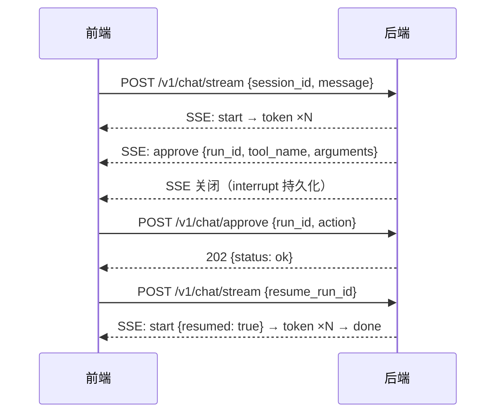

# 方案-后端接口定义 v1

> 📋 **规范**：遵循 `docs/文档规范.md`
> 📌 **更新时间**：2026-08-02
> 📝 **版本变更记录**（永久保存，只追加不删除）：
>
> | 版本 | 日期 | 具体改动（精确到二级标题） |
> |------|------|------|
> | v1.1 | 2026-08-02 | §1.1 路由前缀对齐：本地开发端口约定 8000 → 8010（8000 被遗留进程占用，co-creator 拍板） |
> | v1 | 2026-08-02 | 初版：§2 接口总览 8 个接口；§4 REST 接口定义（会话/消息 6 个）；§5 SSE 流式对话协议（8 类事件 + start 补充）；§6 审批与断点恢复时序；§7 错误码表；§8 前端对接点清单 |

## 目录

- §1 定位与设计原则
- §2 接口总览
- §3 通用约定
- §4 REST 接口定义
- §5 SSE 流式对话协议（核心）
- §6 审批与断点恢复
- §7 错误码表
- §8 前端对接点清单
- §9 待办与未决项

---

## §1 定位与设计原则

> 背景：co-creator 拍板「**定义后端接口，标准输入输出**；前端和后端对接的东西相对较少，**这个项目是重后端的**」。

本项目重后端：Agent 编排、工具调用、记忆、压缩、审批全部在后端内聚。前端只做三件事——**发起对话、展示过程、做审批决策**。因此：

1. **接口面最小化**：前端只对接 8 个接口（6 REST + 2 流式），Agent 内部机制（MCP 工具、记忆读写、子 Agent 委派、压缩）不暴露 REST。
2. **标准输入输出**：所有请求/响应体为 Pydantic 模型（禁裸 dict），字段名统一 snake_case，与 `backend/src/models/` 实体对齐。
3. **单一真相源**：本文件是前后端接口契约的唯一载体；`backend/src/api/` 实现须与本文件一致，`frontend/src/api/types.ts` 从本文件生成。
4. **重后端体现在 SSE 协议**：对话过程中的所有 Agent 内部状态（token 流、工具调用、子 Agent、压缩、审批）通过 SSE 事件流推送，前端是"旁观者 + 决策者"，不是"调度者"。

### 1.1 路由前缀对齐（勘误）

架构文档 §1/§2 老图写作 `/api/chat/stream`；按 `10-api.md` 规则与现有代码（`api/health.py` 实际注册 `/v1/health`），**本文件统一 `/v1/` 前缀**。前端 vite proxy 把 `/v1/` 转发到后端 8000 端口即可。

---

## §2 接口总览

| # | 方法 | 路径 | 用途 | 类型 |
|---|------|------|------|------|
| 1 | GET | `/v1/health` | 健康检查（Redis + SQLite 探活） | REST ✅ 已实现 |
| 2 | POST | `/v1/sessions` | 创建会话 | REST |
| 3 | GET | `/v1/sessions` | 会话列表（按更新时间倒序） | REST |
| 4 | PATCH | `/v1/sessions/{session_id}` | 修改会话标题 | REST |
| 5 | DELETE | `/v1/sessions/{session_id}` | 删除会话（级联删消息） | REST |
| 6 | GET | `/v1/sessions/{session_id}/messages` | 历史消息分页拉取 | REST |
| 7 | POST | `/v1/chat/stream` | **流式对话（核心）**：SSE 事件流 | SSE |
| 8 | POST | `/v1/chat/approve` | 审批决策（通过/拒绝，恢复断点） | REST 薄接口 |

> 不暴露的模块（重后端内聚）：MCP 工具注册、记忆读写、子 Agent 拓扑、压缩策略、沙箱执行——均无 REST 接口，前端只通过 SSE 事件感知其发生。

---

## §3 通用约定

### 3.1 协议与编码

- HTTP 1.1 + JSON（UTF-8）；SSE 用 `text/event-stream`。
- 时间一律 UTC ISO 8601（如 `2026-08-02T04:24:00Z`），与 `models/message.py` 的 `_now_utc()` 一致。
- 字段名 snake_case，前后端共享类型（`frontend/src/api/types.ts` 与后端 Pydantic 字段逐一对齐，不设转换层）。

### 3.2 成功响应

- REST 接口响应体直接返回业务模型（含 `status` 字段的按模型定义），HTTP 200。
- `POST /v1/chat/approve` 语义为「已受理」，HTTP 202。

### 3.3 错误响应（统一 ErrorResponse）

所有 REST 错误（含 SSE 请求阶段错误）统一格式：

```python
class ErrorResponse(BaseModel):
    """统一错误响应（10-api.md 定稿）。"""
    error: str          # 人类可读错误信息
    detail: str         # 具体原因（可含字段级提示）
    code: str           # 错误码（见 §7 错误码表）
```

HTTP 状态码：200 成功 / 400 参数错误 / 403 权限拒绝 / 404 不存在 / 500 内部错误。错误码与 `core/errors.py` 异常分级对齐（retryable / non-retryable）。

### 3.4 分页约定

消息拉取用 **cursor 分页**（消息 id 自增单调，避免 offset 在并发插入下漂移）：

- 请求：`limit`（默认 50，上限 200）+ `before_id`（可选，取小于该 id 的上一页）
- 响应：`items` + `next_before_id`（下一页参数；`has_more=false` 表示到底）

---

## §4 REST 接口定义

### 4.1 GET /v1/health — 健康检查 ✅ 已实现

响应：

```python
class HealthResponse(BaseModel):
    status: str = "ok"            # ok / degraded
    redis: str = "connected"      # connected / disconnected
    sqlite: str = "connected"     # connected / disconnected
    env: str = "dev"              # 当前运行环境
```

说明：只验证地基（Redis + SQLite），不依赖 LLM / 沙箱；任一断开 → 对应字段 disconnected、status=degraded，HTTP 仍 200。

### 4.2 POST /v1/sessions — 创建会话

请求体：空（无参数）。标题默认「新会话」，首条消息后由后端自动生成（策略见 §9 未决项）。

响应（HTTP 200）：

```python
class Session(BaseModel):
    id: str                       # UUID
    title: str = "新会话"
    created_at: datetime          # UTC
    updated_at: datetime          # UTC
```

错误：无特殊业务错误。

### 4.3 GET /v1/sessions — 会话列表

响应（HTTP 200）：

```python
class SessionListResponse(BaseModel):
    status: str = "ok"
    items: list[Session]          # 按 updated_at 倒序（最近活跃在前）
    total: int
```

### 4.4 PATCH /v1/sessions/{session_id} — 修改标题

请求体：

```python
class SessionUpdateRequest(BaseModel):
    title: str                    # 1 ≤ len ≤ 100，非空
```

响应：`Session`（更新后完整对象）。

错误：404 会话不存在；400 标题为空/超长。

### 4.5 DELETE /v1/sessions/{session_id} — 删除会话

响应（HTTP 200）：

```python
class DeleteResponse(BaseModel):
    status: str = "ok"
```

错误：404 会话不存在。级联删除该会话全部消息（schema 已配 `ON DELETE CASCADE`）。

### 4.6 GET /v1/sessions/{session_id}/messages — 历史消息

查询参数：`limit`（默认 50，≤200）、`before_id`（可选 cursor）。

响应（HTTP 200）：

```python
class MessagePage(BaseModel):
    status: str = "ok"
    items: list[Message]          # 按 created_at 升序（会话内自然顺序）
    next_before_id: int | None    # 还有更早消息时返回，否则 None
    has_more: bool

class Message(BaseModel):
    id: int | None                # 未落库为 None（流式场景）
    session_id: str
    role: str                     # user / assistant / system / tool
    content: str
    created_at: datetime
```

错误：404 会话不存在。

---

## §5 SSE 流式对话协议（核心）

### 5.1 POST /v1/chat/stream

**本接口承载项目全部核心语义**：新消息驱动 Agent 执行、审批挂起、断点恢复。前端唯一入口。

请求体：

```python
class ChatStreamRequest(BaseModel):
    session_id: str | None = None      # None → 后端自动新建会话（响应 start 事件带新 id）
    message: str | None = None         # 新消息模式：用户输入
    resume_run_id: str | None = None   # 恢复模式：审批后携带 run_id 重连（与 message 互斥）
```

互斥约束：`message` 与 `resume_run_id` 二选一，同时提供 → 400 `INVALID_PARAMS`；都为空 → 400。

响应：`Content-Type: text/event-stream`。SSE 帧格式统一：

```
data: {"type": "start", "run_id": "...", "session_id": "...", "resumed": false}\n\n
```

**统一信封规则**：每条事件是一个 JSON 对象，**必含 `type` 字段**，其余字段为事件专属 payload（snake_case）。帧只用一个 `data:` 行（不用 `event:` 命名），前端 `EventSource` 统一收 message 事件再按 `type` 分发——解析逻辑最简。

### 5.2 事件类型表（8 类 = 架构定稿 7 类 + start 补充）

| type | 方向 | 触发时机 | 关键字段 |
|------|------|----------|----------|
| `start` | ✅ 补充 | 流建立即发（首次 + resume 均发） | `run_id`, `session_id`, `resumed` |
| `token` | 增量 | 主 Agent 生成文本 | `text` |
| `tool_call` | 过程 | 工具调用状态变化 | `call_id`, `name`, `arguments`, `status`, `result?` |
| `subagent` | 过程 | 子 Agent 委派开始/结束 | `name`, `status`, `summary?` |
| `approve` | 挂起 | 高影响操作需人工审批 | `run_id`, `call_id`, `tool_name`, `arguments`, `message` |
| `summarize` | 过程 | 上下文压缩发生 | `summary`, `removed_count`, `keep_from_message_id` |
| `done` | 结束 | Agent 执行完成，流关闭 | `run_id`, `session_id`, `duration_ms` |
| `error` | 结束 | 流内错误（SSE 已建立后） | `code`, `detail`, `retryable` |

> `start` 补充理由：resume 场景前端需要知道「当前流是恢复旧 run 还是新 run」（渲染是否清空面板、审批弹窗状态重置）；架构定稿 7 类未含此标识，接口层补上，实现层在 Agent 事件流最前插入。

### 5.3 事件 payload 定义（Python 模型 = 序列化契约）

```python
class SSEEvent(BaseModel):
    type: str = Field(description="事件类型，见 5.2 表")

class StartEvent(SSEEvent):
    type: Literal["start"] = "start"
    run_id: str
    session_id: str
    resumed: bool = False          # True = 审批后恢复

class TokenEvent(SSEEvent):
    type: Literal["token"] = "token"
    text: str                      # 增量文本（前端追加渲染，不做缓冲聚合）

class ToolCallEvent(SSEEvent):
    type: Literal["tool_call"] = "tool_call"
    call_id: str
    name: str
    arguments: dict[str, Any]      # 结构化参数（前端三栏面板展示）
    status: Literal["running", "success", "error"]
    result: str | None = None      # 成功/失败时携带（截断到 4KB 防爆，实现层限制）

class SubagentEvent(SSEEvent):
    type: Literal["subagent"] = "subagent"
    name: str
    status: Literal["start", "end"]
    summary: str | None = None     # end 时携带结构化结论摘要

class ApproveEvent(SSEEvent):
    type: Literal["approve"] = "approve"
    run_id: str                    # 前端用该值调 POST /v1/chat/approve
    call_id: str
    tool_name: str
    arguments: dict[str, Any]
    message: str                   # 展示给用户的审批说明（为何需要批准）

class SummarizeEvent(SSEEvent):
    type: Literal["summarize"] = "summarize"
    summary: str
    removed_count: int             # 被压缩掉的消息条数
    keep_from_message_id: int | None   # 保留起点消息 id（断点追踪，F 系经验）

class DoneEvent(SSEEvent):
    type: Literal["done"] = "done"
    run_id: str
    session_id: str
    duration_ms: int

class ErrorEvent(SSEEvent):
    type: Literal["error"] = "error"
    code: str                      # 对齐 §7 错误码
    detail: str
    retryable: bool
```

### 5.4 典型时序（新对话）

```
前端                后端
 │ POST /v1/chat/stream {session_id, message}
 ├───────────────────►│ ① 校验 + 建/取会话
 │◄───────────────────┤ data: {"type":"start", run_id, session_id}
 │◄───────────────────┤ data: {"type":"tool_call", status:"running", ...}
 │◄───────────────────┤ data: {"type":"subagent", status:"start", name:"analyst"}
 │◄───────────────────┤ data: {"type":"subagent", status:"end", name:"analyst", summary}
 │◄───────────────────┤ data: {"type":"tool_call", status:"success", result}
 │◄───────────────────┤ data: {"type":"token", text:"结论是..."}   ×N 增量
 │◄───────────────────┤ data: {"type":"done", run_id, duration_ms}
 │ SSE 正常关闭 ◄──────┤
```

### 5.5 事件顺序保证（协议约束）

1. 首事件必为 `start`；尾事件为 `done` 或 `error`（二选一，之后连接关闭）。
2. `token` 事件按生成顺序发出，前端**只追加不重排**。
3. `tool_call` 同一 `call_id` 至少发出 running →（success|error）两次。
4. `approve` 发出后，**流即挂起并关闭**（后端 interrupt 持久化），后续事件在 resume 后的新连接里继续。
5. 流内错误（如 LLM 超时重试耗尽）→ `error` 事件后关闭；请求阶段错误（参数/鉴权）→ HTTP 4xx + ErrorResponse（不走 SSE）。

---

## §6 审批与断点恢复

### 6.1 审批接口 POST /v1/chat/approve

请求体：

```python
class ApproveRequest(BaseModel):
    run_id: str                       # 来自 approve 事件的 run_id（必填）
    action: Literal["approve", "reject"]
    note: str | None = None           # 拒绝时可选说明，注入 Agent 上下文（实现层）
```

响应（HTTP 202）：

```python
class ApproveResponse(BaseModel):
    status: str = "ok"
    accepted: bool = True             # 已受理（异步恢复，实际执行结果走新 SSE 流）
```

错误：404 `run_id` 不存在或非挂起态（`RUN_NOT_FOUND` / `NOT_PENDING`）；400 action 非法。

### 6.2 完整审批时序（前端视角）

```
① POST /v1/chat/stream {session_id, message}
② 流中收到 approve 事件 → 前端弹窗（展示 tool_name + arguments + message）
③ 流关闭（后端已持久化 interrupt，checkpointer 断点可恢复）
④ 用户点击 → POST /v1/chat/approve {run_id, action}
⑤ 收到 202 → 前端立即重连：POST /v1/chat/stream {resume_run_id: run_id}
⑥ 新流首事件 start {resumed: true} → 前端重置审批弹窗、清空增量缓冲
⑦ 后续 token/tool_call/done 与常规一致
```



### 6.3 设计取舍记录

| 取舍 | 选择 | 理由 |
|------|------|------|
| 审批后事件流如何回推 | **resume 模式重连新 SSE**（非 approve 接口内回流） | 前端复用同一套 SSE 渲染逻辑；approve 保持薄接口（202 即返）；协议单一 |
| 非流式模式（stream=false） | **暂不提供** | 事件协议依赖流式通道（approve 挂起时非流式无法推送）；重后端阶段不做轮询队列，复杂度不值 |
| 审批粒度 | 按 run 粒度（一个 run 同时至多一个 pending 审批） | 与 deepagents interrupt/resume 语义对齐；并发审批 UI 复杂度不入门槛 |

---

## §7 错误码表

对齐 `core/errors.py` 分级（retryable / non-retryable）。

| code | HTTP | 语义 | 重试 |
|------|------|------|------|
| `BAD_REQUEST` | 400 | 参数缺失/类型错（如 message 与 resume_run_id 同时给） | 否 |
| `INVALID_PARAMS` | 400 | 业务校验失败（标题超长、limit 超上限） | 否 |
| `SESSION_NOT_FOUND` | 404 | 会话不存在 | 否 |
| `RUN_NOT_FOUND` | 404 | run_id 不存在（审批对象失效） | 否 |
| `NOT_PENDING` | 400 | run 不处于挂起审批态（重复审批/已恢复） | 否 |
| `AUTH_DENIED` | 403 | 权限拒绝（预留，纯本地 demo 可后置） | 否 |
| `LLM_TIMEOUT` | 500 | LLM 调用超时重试耗尽（流内走 error 事件） | 是 |
| `LLM_UNAVAILABLE` | 500 | LLM 服务不可用（配置/限流） | 是 |
| `INTERNAL` | 500 | 未知内部错误 | 是 |

> SSE 流内错误：HTTP 层已返回 200 后发生的错误 → `error` 事件（`code` 同上表），前端按 `retryable` 决定是否提示重试。

---

## §8 前端对接点清单

前端 `frontend/src/api/` 只需实现 2 个模块：

| 模块 | 接口 | 前端组件 |
|------|------|----------|
| `client.ts` | POST /v1/chat/stream + POST /v1/chat/approve | ChatPage 主流程：SSE 封装（ai SDK）+ 审批弹窗 |
| `types.ts` | 全部模型（§4 §5 事件 payload） | 与后端 Pydantic 逐字段对齐，从本文档生成 |
| 会话列表 | GET/POST/PATCH/DELETE /v1/sessions | HistorySidebar |
| 历史消息 | GET /v1/sessions/{id}/messages | HistorySidebar 点击载入 + 会话恢复渲染 |

**前端不感知**：MCP 工具注册表、记忆读写、压缩策略、子 Agent 拓扑、沙箱执行——这些全部后端内聚，前端仅通过 SSE 事件类型感知过程（tool_call/subagent/summarize）。

---

## §9 待办与未决项

| 优先级 | 事项 | 状态 |
|--------|------|------|
| P0 | 本契约落库为 `backend/src/api/chat.py` + `history.py` 实现，模型进 `src/models/` | ⏳ 待做 |
| P0 | SSE 事件协议单测（事件类型/顺序保证/approve 挂起恢复） | ⏳ 待做（20-testing.md 多 Agent 专项） |
| P1 | 会话标题自动生成策略（首条消息截断 vs LLM 摘要） | ⚠️ 未决 |
| P1 | 架构文档 v3 承接：模块接口签名（State/SSE 事件表/MCP 注册/记忆读写）引用本文档 | ⏳ 待做 |
| P2 | `usage`（token 统计）是否进 done 事件 | ⚠️ 未决（先留接口位，实现后置） |
| P2 | 鉴权（AUTH_DENIED 预留位）——纯本地 demo 后置 | ⚠️ 未决 |
